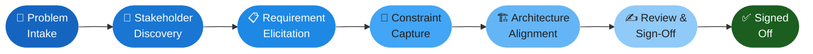
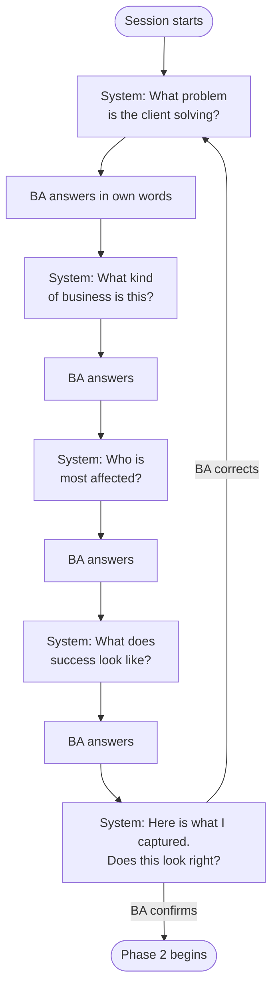
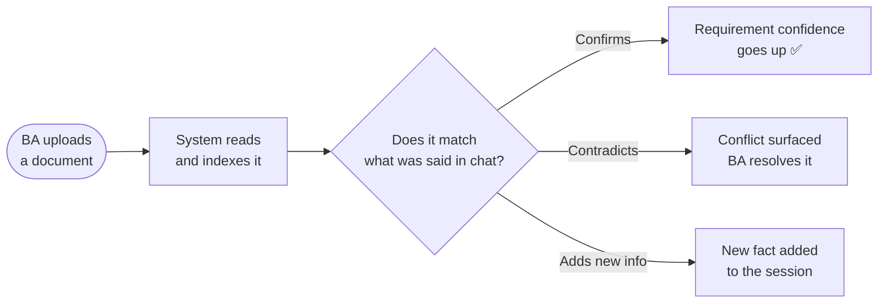

# 01 — The BA Journey

Chitragupt guides a Business Analyst from a raw problem description to a signed-off document — through conversation alone. No forms. No templates to fill in. Just questions and answers, one at a time.

---

## The Seven Phases

Every session moves through seven phases in order. Each phase has a clear goal. The system does not advance until that goal is met and the BA confirms it.

> **Sprint 1** covers Phases 1–4. Architecture Alignment and Sign-Off are Sprint 2.

---

## What One Phase Looks Like

The session opens with the simplest possible question: *"What problem are you trying to solve?"* From there, the system leads — one question at a time — until four things are established. Then it asks the BA to confirm what it captured. Only then does it offer the next phase.

This same pattern repeats in every phase. The BA is never presented with a blank canvas.

---

## What Happens When the BA Uploads a Document

The BA can upload a document at any point — a brief, an org chart, meeting notes, a compliance policy. The system reads it immediately and adjusts what it knows. An uploaded document is evidence, not an attachment.

A session without any uploaded documents can still produce a BRD. Requirements sourced only from conversation will carry a lower confidence score and a visible warning tag in the final document.
