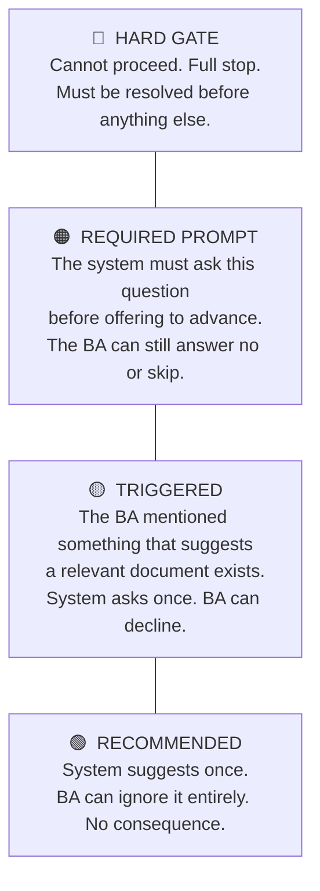
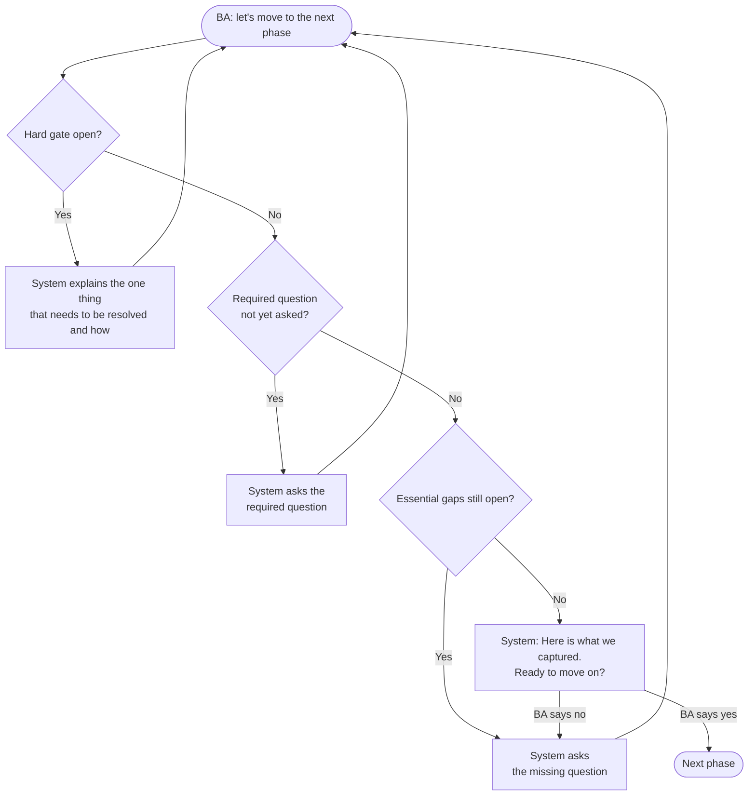
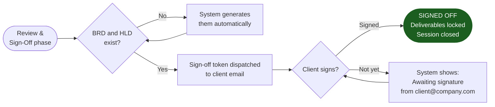

# 02 — Checkpoints and Gates

The system enforces checkpoints. Some are questions it must ask before the session can move forward. Some are documents that must exist. One is a client signature. These are called **gates** — and not all gates are equal.

---

## The Four Gate Types

| Gate type | Can the BA skip it? | What happens if they do |
|---|---|---|
| HARD GATE | No | Session cannot advance — period |
| REQUIRED PROMPT | Yes, after the question is asked | The decline is recorded |
| TRIGGERED | Yes | Confidence on related requirements drops |
| RECOMMENDED | Yes | No impact |

---

## What the BA Sees When Trying to Advance

When the BA says "let's move on," the system runs a silent checklist. From the BA's perspective, they just see the system's next message.

The BA never sees an error message. They see one clear next step.

---

## The One Gate With No Workaround: Client Signature

The final transition — from Review to Signed Off — requires a recorded client signature. No BA confirmation substitutes for it. A BRD without a client signature is a draft, not a deliverable.

