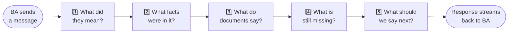
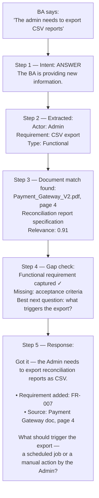

# 03 — How the System Thinks on Every Turn

Every time the BA sends a message, the system runs five steps before responding. The whole process takes under two seconds. The BA sees the response arriving word by word as it streams back.

---

## The Five Steps

Each step has one job and hands its result to the next step.



| Step | What it does | How fast |
|---|---|---|
| 1 — Intent | Is the BA answering, confirming, correcting, skipping, or asking a question? | < 200ms |
| 2 — Extract | Pull out structured facts: actors, requirements, constraints, numbers | ~500ms |
| 3 — Retrieve | Search uploaded documents for anything relevant to what was just said | ~300ms |
| 4 — Gaps | Which phase criteria are still unmet? What is the best next question? | ~400ms |
| 5 — Generate | Write the response: acknowledge, show what was captured, ask one question | 1–3s (streamed) |

---

## A Real Example



---

## The Response Always Looks the Same

No matter what the BA said, no matter which path the pipeline took, every response follows this structure. No walls of text. No multiple questions at once.

```
One sentence    →  What the system understood, paraphrased back.

0 to 3 bullets  →  What was captured and added to the session.
                   (left out if nothing new was captured this turn)

One sentence    →  The single next action:
                   a question, a transition offer, or a gate prompt.
```

The BA always knows exactly what to do next. That is the contract this pipeline exists to keep.
