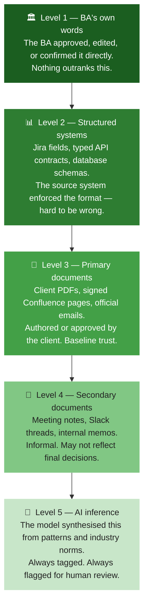
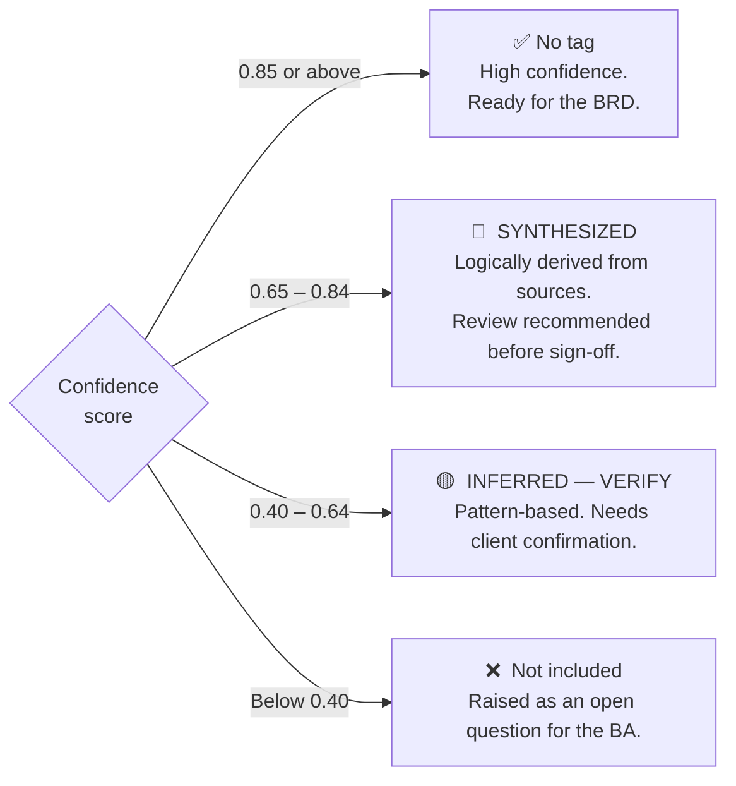
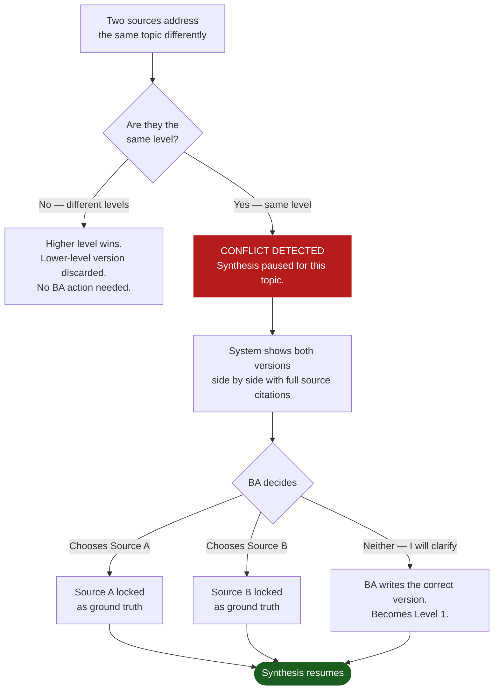

# 04 — How the System Decides What to Believe

Chitragupt reads documents, listens to conversations, and uses AI to fill in gaps. Not all of these sources are equally reliable. The system keeps track of exactly where every piece of information came from — and how confident it is.

---

## The Trust Ladder

Every fact in the session has a source. Sources are ranked. Higher rank always wins.

**The critical rule:** An AI inference can never silently overwrite something a client document said. Level 5 does not beat Level 3.

---

## What the Confidence Score Means

Every requirement the system produces carries a score from 0 to 1. That score determines what tag — if any — appears next to it in the BRD.

Anything extracted from a diagram or screenshot is capped at 0.80 regardless of score, and always carries `[VISUAL EXTRACTION — VERIFY]`. A diagram is an illustration, not a contract.

---

## When Two Sources Say Different Things

The system never picks a winner on its own. If two sources of the same level say different things, synthesis halts and the BA decides.

The BA knows the client. The model does not. That is why the BA makes the call.
