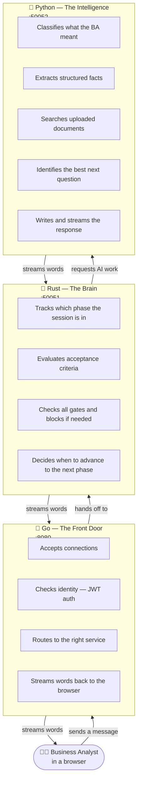
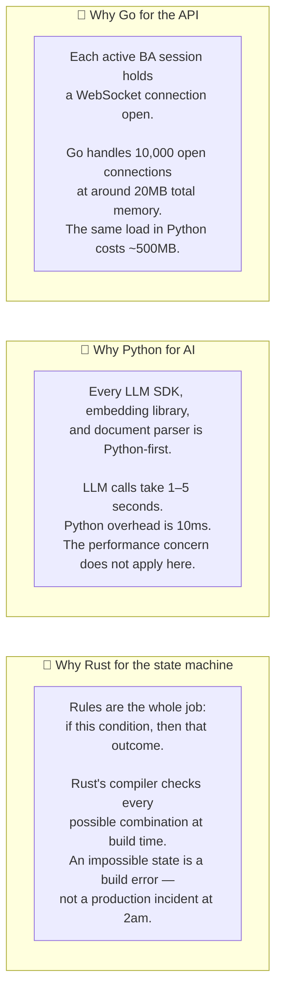

# 05 — The Three Services

Chitragupt is three separate programs, each written in a different language. They never share code. They pass messages to each other over a well-defined channel. Each one is responsible for exactly one domain — and has no authority over the others.

---

## One Job Each

The BA types a message. It flows in: Go → Rust → Python. The response streams back: Python → Rust → Go → Browser. The BA sees words appearing in real time.

---

## Why These Three Languages

Each language was chosen because it is genuinely the best fit for that specific job.

---

## What Each Service Owns

A key design principle: each service has authority over exactly one domain. It cannot reach into another service's territory.

| | Go | Rust | Python |
|---|---|---|---|
| **Responsible for** | Auth, routing, WebSocket, streaming | Session state, phases, AC, gates | LLMs, RAG, extraction, generation |
| **Not allowed to** | Evaluate criteria or call LLMs | Parse documents or call LLM APIs | Make gate decisions or change session state |
| **Owns in the database** | Nothing (reads session for auth only) | `session` table | `document`, `chunk`, `requirement` tables |
| **If it goes down** | No new connections accepted | Sessions freeze mid-turn | AI responses stop; state machine waits |

This separation means a faster AI model in Python does not require touching Go or Rust. A new gate rule in Rust does not require changing any Python prompt.
