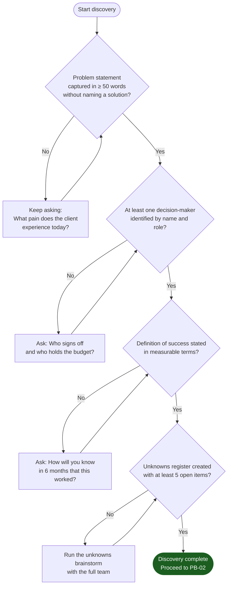
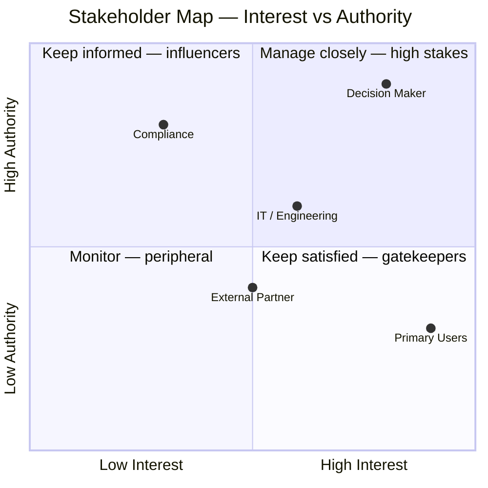

# PB-01 — Problem Discovery

**Version:** v0.1
**The question:** What are we actually building, for whom, and why does it matter?
**When to use:** Day one of any new engagement — before a single architectural decision is made.

---

## Why This Comes First

Most failed projects were not failed builds. They were failed discoveries. The team built the wrong thing correctly.

Discovery answers four questions that no amount of engineering skill can substitute for:
1. What problem is the client actually experiencing — not the solution they think they want?
2. Who is affected, who has authority, and who will sign off?
3. What does success look like in plain language?
4. What do we not know yet that could invalidate everything?

A BA who can answer all four has done a discovery. A BA who has written a feature list has not.

---

## Phase Gates

These must be true before leaving discovery. None are optional.



---

## The Discovery Question Bank

Run these in order. Do not skip sections even if you think you know the answer.

### Section A — The Problem

| # | Question | What you are listening for |
|---|---|---|
| A1 | Describe the client's day-to-day without your solution. What is frustrating or broken? | Pain points in their current process |
| A2 | How long has this been a problem? | Urgency signal — long-standing problems have workarounds you need to discover |
| A3 | What have they tried before? Why did it not work? | Constraints on the solution space |
| A4 | What happens if this problem is not solved? | Severity and buy-in signal |
| A5 | What is the single most important outcome this project must achieve? | The definition of success |

### Section B — The People

| # | Question | What you are listening for |
|---|---|---|
| B1 | Who uses the current process today? (List every role) | Actor inventory |
| B2 | Who would use the new system? (Same list or different?) | Scope boundary signal |
| B3 | Who decides whether this project is funded and approved? | Decision-maker identification |
| B4 | Who can say "stop" — i.e., who has veto power? | Risk and dependency identification |
| B5 | Are there external parties — regulators, partners, auditors — who have requirements? | Compliance and integration signals |

### Section C — The Constraints

| # | Question | What you are listening for |
|---|---|---|
| C1 | What is the approximate budget? (Order of magnitude is fine) | Feasibility filter |
| C2 | Is there a hard deadline? What drives it? | Timeline anchor |
| C3 | What existing systems must this connect to? | Integration complexity signal |
| C4 | What data is involved? Is any of it sensitive, regulated, or cross-border? | Compliance and data residency signal |
| C5 | What must the system never do? | Hard constraints |

### Section D — The Unknowns

| # | Question | What you are listening for |
|---|---|---|
| D1 | What are we assuming that might turn out to be wrong? | Assumption risks |
| D2 | What information do we not have yet that we need? | Knowledge gaps |
| D3 | Who do we need to talk to that we have not talked to yet? | Stakeholder gaps |
| D4 | What external events could derail this project? | External risks |

---

## Template: Problem Statement

Copy this template. Fill it in. The filled version is the discovery deliverable.

```
PROJECT: [Project name]
DATE: [Discovery date]
BA: [Your name]

PROBLEM STATEMENT
-----------------
The [client organisation] currently [describe the pain in present tense — what happens today].
This causes [describe the impact — time lost, errors made, risk created, cost incurred].
The people most affected are [roles/teams/users].
The business cost of not solving this is [quantify if possible].

DEFINITION OF SUCCESS
---------------------
This project succeeds when:
1. [Measurable outcome 1]
2. [Measurable outcome 2]
3. [Measurable outcome 3]

DECISION MAKER
--------------
Name: [Name]
Role: [Role]
Sign-off authority: [What they approve]

OUT OF SCOPE (explicit)
-----------------------
This project does NOT cover:
- [Item 1]
- [Item 2]
```

---

## Template: Stakeholder Map

```
STAKEHOLDER INVENTORY
---------------------

| Name/Role | Type | Interest | Authority | Notes |
|---|---|---|---|---|
| [Name] | Internal/External | High/Medium/Low | Decision/Input/Inform | [Any notes] |
```



> Replace the positions with your actual stakeholders. High Interest + High Authority = manage most closely.

---

## Template: Unknowns Register

Every open item must have an owner and a resolution date. An unknown without an owner is a risk that will re-surface later.

```
UNKNOWNS REGISTER
-----------------
Date: [Date]
Project: [Project name]

| ID | Unknown | Category | Assumption if unresolved | Owner | Due | Resolved? |
|---|---|---|---|---|---|---|
| U-001 | [What we don't know] | Technical/Business/Regulatory | [What we'll assume until resolved] | [Name] | [Date] | No |
| U-002 | | | | | | |
```

Categories: **Technical** (how to build), **Business** (what to build), **Regulatory** (constraints on the build).

---

## What Goes Wrong Without This

| Skipped step | Typical consequence | When it surfaces |
|---|---|---|
| Problem statement not in client's words | System solves a slightly different problem | Sprint 2 demo |
| Decision-maker not identified | Approval stalls; project sits in review | End of Sprint 1 |
| Success not defined in measurable terms | Client says "it's not quite right" with no way to resolve | Sign-off meeting |
| Unknowns not documented | A dependency appears mid-build that was always there | Sprint 3 planning |
| Out-of-scope not stated | Scope creep becomes structural | Anywhere |

---

## Chitragupt Decision

> **How we ran discovery for Chitragupt:**
> The discovery phase produced an epistemology document (what can we know and how), an ontology (what entities exist in this domain), a set of invariants (what is always true), and a stakeholder unknowns register answered from the client's perspective. These became the foundation that all Sprint 0 decisions were built on.
> Reference: `docs/sprints/sprint0/ARCHITECTURE.md` (trust model and invariants), `docs/sprints/sprint0/ONTOLOGY.md` (entity definitions).

---

> Chitragupt Playbooks · PB-01 Discovery · v0.1 · May 2026
