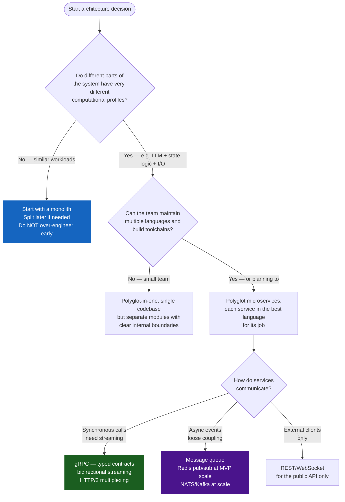
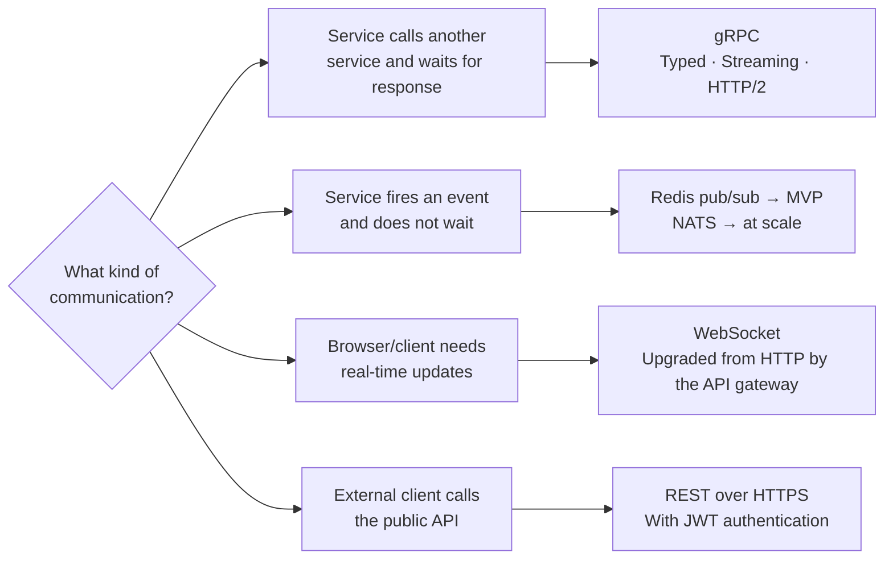

# PB-02 — System Architecture Decisions

**Version:** v0.1
**The question:** How should the system be structured — one service or many, which languages, how do they communicate?
**When to use:** After discovery is complete, before Sprint 0 documents are written.

---

## Why Architecture Comes Before Code

Architecture decisions are the most expensive decisions to change. A wrong choice of database is a migration. A wrong service boundary is a rewrite. A wrong communication protocol is a re-architecture.

Sprint 0 exists to make these decisions at the point when they cost nothing — before a line of code is written. This playbook gives a BA the framework to drive those decisions without needing to be an engineer.

---

## The Core Architecture Question

Every system is either:
- **One service** that does everything (monolith)
- **Multiple services** that each do one thing (microservices or polyglot)

The decision is not about "modern" vs "legacy." It is about the **computational profiles** of the different jobs the system needs to do.



---

## The Service Responsibility Matrix

Before writing any architecture document, fill this matrix. If a cell is blank or has multiple owners, the boundary is not defined yet.

```
SERVICE RESPONSIBILITY MATRIX
------------------------------

| Concern | Service A | Service B | Service C | Notes |
|---|---|---|---|---|
| Session / state ownership | | | | Must have exactly one owner |
| LLM / AI calls | | | | Should be isolated from business logic |
| User-facing API (HTTP/WS) | | | | Only one service talks to the outside world |
| Document storage | | | | Owner controls the S3/blob bucket |
| Cache (Redis) | | | | Multiple services may read; one service owns each key namespace |
| Database tables | | | | Each table has exactly one owning service |
| Authentication | | | | Validated at the boundary, propagated as claims |

RULE: If a cell has two owners, the boundary is wrong. Redesign before proceeding.
```

---

## Communication Protocol Selection



| Protocol | Use for | Do NOT use for |
|---|---|---|
| **gRPC** | Internal service-to-service calls; streaming token delivery | Public client APIs (browser does not speak gRPC natively) |
| **REST** | External clients; webhooks from third-party systems | Internal calls where typing and streaming matter |
| **WebSocket** | Browser-to-server streaming (tokens, events) | Service-to-service calls (use gRPC instead) |
| **Redis pub/sub** | Async cross-service events (file ingested, budget threshold hit) | Calls that need a response; high-volume throughput events |

---

## The Trust Model

Every system that handles client data needs an explicit trust model — a statement of who can see what, and what happens when sources conflict.

### Multi-Tenancy Invariant

If the system serves more than one client (workspace), this rule is non-negotiable:

> **Every database query that returns client data must include `tenant_id` in the WHERE clause.** Row-Level Security (RLS) is the safety net, not a substitute for correct query construction.

Failure to enforce this is not a bug — it is a data breach.

### Source Trust Hierarchy Template

```
TRUST HIERARCHY — [Project Name]
---------------------------------

Level 1 — Human approval    : Any fact the user has explicitly confirmed.
                              Cannot be overwritten by the system.
Level 2 — Structured data   : Database records, typed API responses.
                              High trust — source system enforced structure.
Level 3 — Primary documents : Official PDFs, signed contracts, formal emails.
                              Baseline trust — authored by the client.
Level 4 — Secondary docs    : Meeting notes, Slack threads, informal memos.
                              Moderate trust — may not reflect final state.
Level 5 — AI inference      : Pattern-based synthesis by the LLM.
                              Always tagged, always verifiable.

RULE: A lower level can never silently overwrite a higher level.
      A Level 5 inference does not beat a Level 3 document.
```

---

## Architecture Decision Record Template

Every architectural decision made in Sprint 0 must be recorded in this format. "We decided to use X" is not a decision record. The alternative considered and the reason it was rejected are what make the record valuable.

```
DECISION: D-[NNN] — [Short title]
----------------------------------
Status:    DECIDED / DEFERRED / OPEN
Date:      [Date]

QUESTION
What architectural question does this answer?

CONTEXT
Why did this decision need to be made? What constraints were in play?

DECISION
We chose: [Option chosen]
Because: [1-3 clear reasons, stated in plain language]

ALTERNATIVES CONSIDERED
Option A — [Name]: [Description]. Rejected because: [Reason].
Option B — [Name]: [Description]. Rejected because: [Reason].

CONSEQUENCES
What does this decision make easier? What does it make harder?

REVISIT CONDITION
Under what circumstances should this decision be reconsidered?
```

---

## Service Boundary Checklist

Before freezing the architecture, answer every question. Any "No" is a gap to resolve.

```
ARCHITECTURE COMPLETENESS CHECK
---------------------------------

[ ] Every service has exactly one stated responsibility
[ ] Every piece of data has exactly one owning service
[ ] Every inter-service call has a defined protocol (gRPC, REST, or event)
[ ] The multi-tenancy invariant is documented and enforced at the boundary layer
[ ] A trust hierarchy is defined for all information sources
[ ] All architectural decisions are recorded in the decision register
[ ] Independent scaling axes are identified (which services scale differently)
[ ] A "what happens when X goes down" statement exists for every service
[ ] No service's business logic depends on another service's internal implementation
[ ] Proto files (or API contracts) are the single source of truth for inter-service calls
```

---

## What Goes Wrong Without This

| Skipped decision | Typical consequence | When it surfaces |
|---|---|---|
| No service boundary matrix | Two services share ownership of session state; race conditions | Sprint 2 integration |
| No multi-tenancy invariant | Tenant A can see Tenant B's data | Security audit or incident |
| Communication protocol not decided | gRPC chosen mid-sprint; Go and Python generate incompatible stubs | Sprint 1 week 2 |
| No trust hierarchy | LLM inference silently overwrites client document; incorrect BRD | Client sign-off |
| Decision record not kept | Decision is revisited in Sprint 2 with no record of why it was made | Any sprint retrospective |

---

## Chitragupt Decision

> **How we structured Chitragupt:**
> Three services with different computational profiles: Rust for deterministic state logic (exhaustive compile-time matching), Python for AI/ML (LLM ecosystem is Python-first), Go for concurrent WebSocket connections (goroutines at 2KB each vs 2MB threads). gRPC between services for typed streaming. REST/WebSocket for the public API only. Trust hierarchy with 5 levels, LLM inference always at Level 5.
> Reference: `docs/sprints/sprint0/TECH_STACK.md`, `docs/sprints/sprint0/ARCHITECTURE.md`, `docs/sprints/sprint0/DECISIONS.md` (D-001 through D-014).

---

> Chitragupt Playbooks · PB-02 Architecture · v0.1 · May 2026
