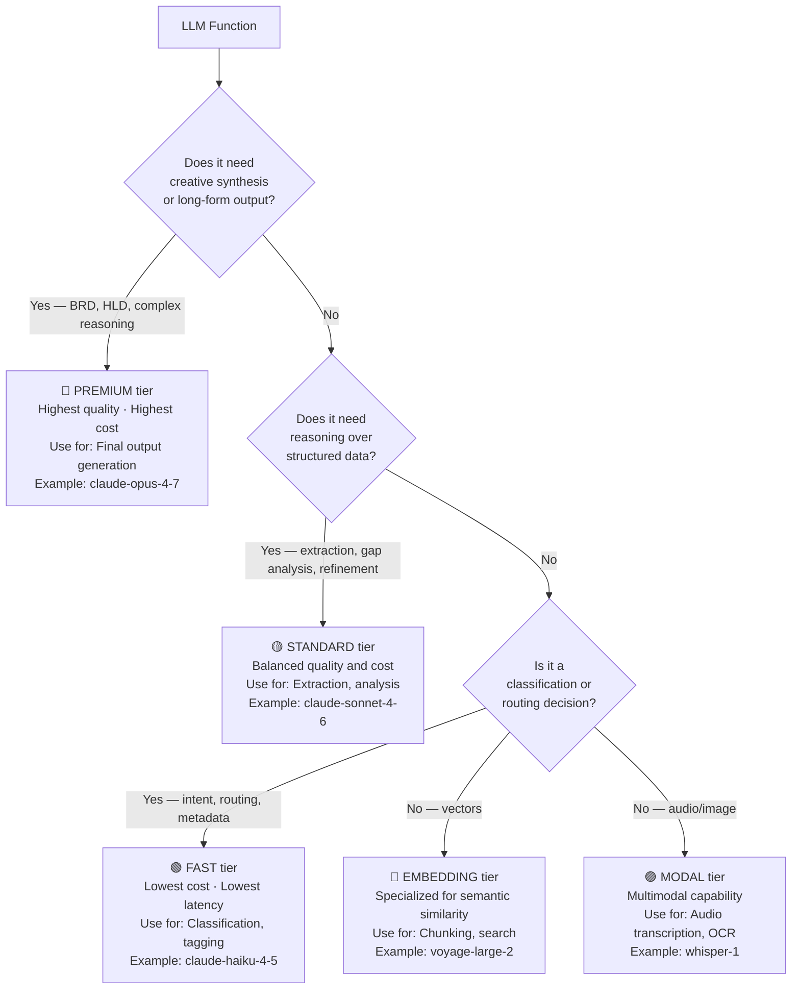
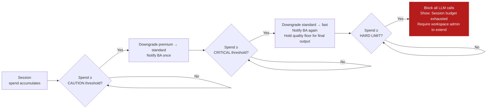
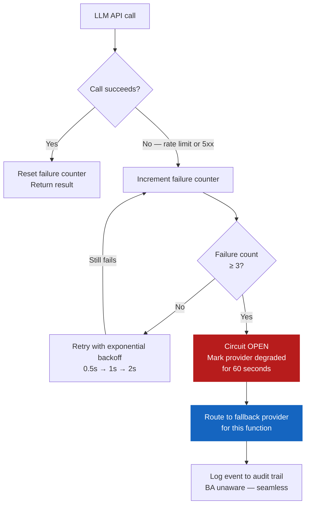
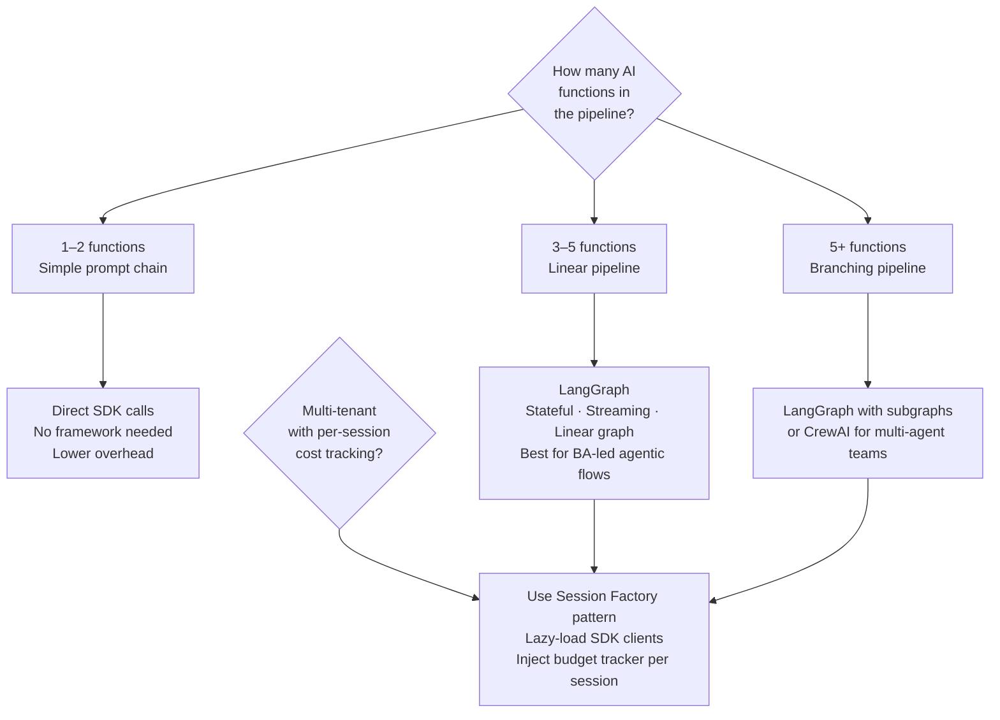

# PB-03 — AI & LLM Strategy

**Version:** v0.1
**The question:** Which AI capabilities does this system need, which models do we use, how do we control cost, and what happens when something goes wrong?
**When to use:** Sprint 0, alongside architecture decisions. AI strategy and architecture are not independent — they constrain each other.

---

## The AI Strategy Problem

Every AI-capable system eventually faces the same four failures:
1. **Wrong model for the job** — using a premium model for a task that needs a fast one; using a fast model for a task that needs quality.
2. **No budget control** — cost per session grows unbounded; invoices arrive before the client does.
3. **No degradation plan** — one provider outage takes down the whole product.
4. **Hallucinations in the output** — the model produces confident, plausible, wrong information that makes it into the deliverable.

This playbook gives you a framework to address all four before writing any AI code.

---

## Step 1: Build the LLM Function Inventory

List every AI function the system must perform. Do not design around specific models yet — identify the function first.

```
LLM FUNCTION INVENTORY
-----------------------
Project: [Project name]
Date: [Date]

| # | Function | What it does | Input | Output | Latency sensitivity |
|---|---|---|---|---|---|
| F-01 | Intent Classification | Understand what the user is trying to do | User message | Intent code (enum) | High — < 300ms |
| F-02 | Entity Extraction | Pull structured facts from conversation | Message + context | Typed entities | Medium — < 1s |
| F-03 | RAG Retrieval | Search uploaded documents for relevant context | Query + vectors | Ranked chunks | Medium — < 500ms |
| F-04 | Gap Analysis | Identify what is still missing | Session state | Next question | Medium — < 1s |
| F-05 | Guidance Generation | Write the response to the user | All of the above | Streamed text | Low — streaming, first token < 2s |
| F-06 | Document Chunking | Split documents into retrievable pieces | Raw document | Chunks with metadata | Low — async |
| F-07 | Embedding | Convert chunks to vectors for search | Text | Float vector | Medium — batch |
| F-08 | [Add your functions] | | | | |
```

---

## Step 2: Assign Model Tiers

Once you have the function inventory, assign each function to a tier. The tier determines cost, latency, and quality.



### Function-to-Tier Map Template

```
MODEL ASSIGNMENT — [Project name]
-----------------------------------

| Function | Tier | Pinned Model ID | Fallback Model ID |
|---|---|---|---|
| Intent Classification | Fast | claude-haiku-4-5-20251001 | gemini-2.0-flash |
| Entity Extraction | Standard | claude-sonnet-4-6 | gemini-2.0-flash |
| Gap Analysis | Standard | claude-sonnet-4-6 | gemini-2.0-flash |
| Guidance Generation (normal) | Standard | claude-sonnet-4-6 | gemini-2.0-flash |
| Guidance Generation (BRD/HLD) | Premium | claude-opus-4-7 | claude-sonnet-4-6 |
| Embedding | Embedding | voyage-large-2 | text-embedding-3-small |
| Speech-to-text | Modal | whisper-1 | gemini-2.0-flash |
| [Your function] | | | |

RULE: All model IDs must be pinned. No floating aliases.
      A model alias resolves to whatever the provider's "latest" is —
      which can change without warning and break evaluations.
```

---

## Step 3: Design the Budget Strategy

Every agentic session costs money. The question is not whether to have a budget — it is where the thresholds are and what happens when they are crossed.

### Budget Threshold Design



### Budget Template

```
BUDGET STRATEGY — [Project name]
----------------------------------

Session hard limit:         $[X].00   — all LLM calls blocked at this point
Caution threshold:          $[X].00   — premium → standard; BA notified once
Critical threshold:         $[X].00   — standard → fast; BA notified again
Quality floor (final output): [standard/premium]  — never degrade below this for deliverables

Monthly workspace cap:      $[X].00   — org-level guard
Alert at:                   $[X].00   — notify workspace admin

NOTES:
- Cost per turn estimate: $[X] (standard pipeline) / $[X] (premium pipeline)
- Estimated cost per completed session: $[X]–$[X]
- At [N] sessions/month, expected monthly cost: $[X]–$[X]
```

---

## Step 4: Plan the Degradation Matrix

A degradation plan is the insurance policy for when a provider has an outage, a rate limit, or a sudden price change.

### The Two Types of Degradation

| Type | Trigger | Response |
|---|---|---|
| **Budget degradation** | Session cost crosses threshold | Downgrade to cheaper tier (same provider) |
| **Provider degradation** | 3+ consecutive provider failures | Switch to fallback provider (cross-vendor) |

### Provider Circuit Breaker Pattern



### Degradation Matrix Template

```
DEGRADATION MATRIX — [Project name]
--------------------------------------

| Function | Primary Provider | Primary Model | Fallback Provider | Fallback Model | Quality floor |
|---|---|---|---|---|---|
| Intent Classification | Anthropic | claude-haiku-4-5 | Google | gemini-2.0-flash | none |
| Entity Extraction | Anthropic | claude-sonnet-4-6 | Google | gemini-2.0-flash | none |
| Final output (BRD) | Anthropic | claude-opus-4-7 | Anthropic | claude-sonnet-4-6 | standard |
| Embedding | Voyage | voyage-large-2 | OpenAI | text-embedding-3-small | none |

NOTE on mixed embedding: If you switch embedding providers mid-project,
all existing vectors must be re-embedded with the new model.
Different models produce incompatible vector spaces.
Document this risk in the decisions register.
```

---

## Step 5: Choose the Orchestration Framework

The orchestration framework is how you wire the AI functions together into a pipeline.



### Framework Quick Reference

| Framework | Best for | Not for |
|---|---|---|
| **Direct SDK** | 1–2 LLM calls, simple chatbots | Multi-step pipelines, streaming |
| **LangGraph** | Sequential agentic pipelines with streaming | Multi-agent team coordination |
| **CrewAI** | Multi-agent systems with role-based agents | Linear pipelines (overkill) |
| **LangChain** | Document Q&A, simple chains | Complex stateful agentic flows |
| **AutoGen** | Research and multi-step reasoning agents | Production-grade streaming systems |

---

## Step 6: Prompt Caching Strategy

Prompt caching is the highest-leverage cost reduction in a production AI system. Anthropic charges ~10% of standard input pricing for cached tokens. At scale, this is a 30–40% cost reduction.

### What to cache

```
CACHEABLE (static per phase/session):          NOT CACHEABLE (variable per turn):
-----------------------------------------      ----------------------------------------
System prompt                                  User's message this turn
Phase instructions                             Retrieved document chunks
Output schema (JSON structure)                 Current AC status
BA conversation protocol                       Extracted entities so far
```

**Rule:** Place all cacheable content in `cache_control: ephemeral` blocks. Place variable content after the cache break. Never mix them in one block.

---

## AI Strategy Completeness Checklist

```
AI STRATEGY SIGN-OFF
---------------------

[ ] LLM function inventory is complete — every AI function listed
[ ] Every function is assigned a tier with a pinned model ID
[ ] Every function has a fallback model (cross-vendor where possible)
[ ] Budget thresholds defined: caution, critical, hard limit
[ ] Quality floor defined for final output functions (BRD, HLD)
[ ] Circuit breaker behaviour documented
[ ] Orchestration framework chosen and rationale recorded
[ ] Prompt caching strategy defined (what is cached, what is not)
[ ] Mixed-embedding risk acknowledged if fallback embedding differs
[ ] All model IDs pinned — no floating aliases anywhere
```

---

## What Goes Wrong Without This

| Skipped step | Typical consequence | When it surfaces |
|---|---|---|
| No tier assignment | Premium model used for intent classification; cost 10× higher than necessary | First invoice |
| No budget cap | Session with long-running BRD generation costs $50; multiply by 100 sessions | Second invoice |
| No degradation plan | Provider has 2-hour outage; product is completely down | First outage |
| No quality floor | BRD generated by Haiku at critical budget; deliverable is unusable | Client delivery |
| Floating model aliases | Provider silently updates "claude-sonnet-latest"; evaluation breaks | After provider update |

---

## Chitragupt Decision

> **How we defined the Chitragupt AI strategy:**
> Five LLM functions in a linear LangGraph pipeline. Haiku for intent classification (<200ms), Sonnet for extraction and gap analysis, Opus for BRD/HLD generation. Voyage for embeddings. Budget thresholds at $3 (caution), $4.50 (critical), $5 (hard). BRD quality floor at standard — never Haiku for deliverables. Google as cross-vendor fallback for all Anthropic tiers.
> Reference: `docs/sprints/sprint1/LLM_UNIVERSE.md`, `docs/sprints/sprint1/LLM_DEGRADATION.md`, `services/ai-orchestration/config/orchestration.yaml`.

---

> Chitragupt Playbooks · PB-03 AI & LLM Strategy · v0.1 · May 2026
