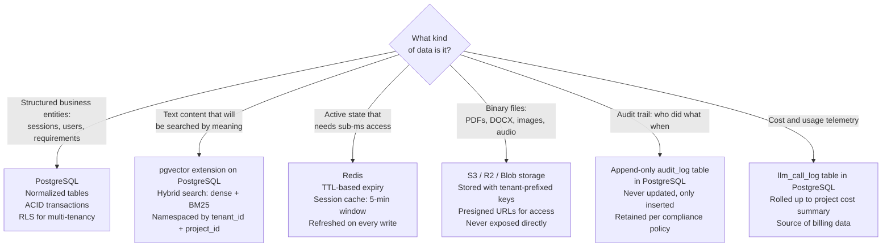

# PB-04 — Data Architecture

**Version:** v0.1
**The question:** Where does every piece of data live, who owns it, how is it kept safe across tenants, and how do we search it?
**When to use:** Sprint 0, alongside architecture decisions. Data ownership and service boundaries are two sides of the same decision.

---

## The Data Problem in Agentic Systems

Agentic systems manage three kinds of data simultaneously, and they require completely different storage strategies:

| Kind | Examples | Access pattern | Storage type |
|---|---|---|---|
| **Structured state** | Session phase, entities, decisions, AC status | Read/write on every turn | PostgreSQL |
| **Semantic content** | Uploaded documents, chunked text, embeddings | Search by meaning, not ID | pgvector (PostgreSQL extension) |
| **Ephemeral cache** | Active session state, rate limit counters | Sub-millisecond reads, TTL expiry | Redis |

Getting this wrong is expensive. Storing vectors in a relational table without the pgvector extension makes every semantic search a full table scan. Storing session state only in memory means it vanishes on restart. Storing raw documents in PostgreSQL JSONB means your database grows without bound.

---

## The Storage Decision Tree



---

## The Multi-Tenancy Invariant

This is the single most important rule in multi-tenant data architecture:

> **Every database query that accesses tenant data must filter by `tenant_id`.
> Row-Level Security is the safety net — not a substitute for correct queries.**

### Implementing RLS (PostgreSQL)

```sql
-- Enable RLS on every tenant-data table
ALTER TABLE sessions ENABLE ROW LEVEL SECURITY;

-- Create the policy — only the owning tenant can see their rows
CREATE POLICY tenant_isolation ON sessions
    USING (tenant_id = current_setting('app.current_tenant_id')::uuid);

-- The application sets this at the start of every database transaction
SET LOCAL app.current_tenant_id = '[tenant_id_from_jwt]';
```

**Non-negotiable tables for RLS:** sessions, documents, chunks, requirements, constraints, actors, llm_call_log, audit_log.

**Tables that do not need RLS:** System config, model version registry, migration history.

---

## Schema Design Principles

### The Session State Pattern

Session state is the beating heart of any agentic system. It must be:
- **Persisted after every turn** (atomic write — the state machine writes to PostgreSQL)
- **Cached for active sessions** (Redis with TTL — avoids a DB hit on every message)
- **Serializable** (JSONB in PostgreSQL — the full state is one column)

```sql
CREATE TABLE sessions (
    id              UUID PRIMARY KEY DEFAULT gen_random_uuid(),
    tenant_id       UUID NOT NULL REFERENCES workspaces(id),
    workspace_id    UUID NOT NULL,
    project_id      UUID NOT NULL,

    -- The full session state — serialized by the state machine service
    state_json      JSONB NOT NULL DEFAULT '{}',

    -- Fast-access fields (denormalized from state_json for indexed queries)
    current_phase   TEXT NOT NULL DEFAULT 'ProblemIntake',
    is_signed_off   BOOLEAN NOT NULL DEFAULT false,
    session_cost_usd DECIMAL(10,4) NOT NULL DEFAULT 0,

    created_at      TIMESTAMPTZ NOT NULL DEFAULT now(),
    updated_at      TIMESTAMPTZ NOT NULL DEFAULT now()
);

-- Always filter by tenant_id + indexed phase for active session queries
CREATE INDEX sessions_tenant_phase_idx ON sessions(tenant_id, current_phase);
```

### The Vector Storage Pattern

```sql
-- Enable pgvector
CREATE EXTENSION IF NOT EXISTS vector;

CREATE TABLE chunks (
    id              UUID PRIMARY KEY DEFAULT gen_random_uuid(),
    tenant_id       UUID NOT NULL REFERENCES workspaces(id),
    document_id     UUID NOT NULL REFERENCES documents(id),
    project_id      UUID NOT NULL,
    session_id      UUID NOT NULL REFERENCES sessions(id),

    -- Content
    content         TEXT NOT NULL,
    chunk_index     INTEGER NOT NULL,

    -- Embedding — dimension must match the embedding model
    embedding       vector(1536),   -- voyage-large-2 output dimension

    -- Metadata for hybrid search and filtering
    source_page     INTEGER,
    section_title   TEXT,
    entity_hints    TEXT[],         -- detected entity types in this chunk
    trust_tier      SMALLINT NOT NULL DEFAULT 3,  -- matches trust hierarchy levels

    created_at      TIMESTAMPTZ NOT NULL DEFAULT now()
);

-- HNSW index — approximate nearest-neighbour search; ~10ms for 1M vectors
CREATE INDEX chunks_embedding_idx ON chunks
    USING hnsw (embedding vector_cosine_ops)
    WITH (m = 16, ef_construction = 64);

-- Always namespace by tenant + project — never search across tenants
CREATE INDEX chunks_tenant_project_idx ON chunks(tenant_id, project_id);
```

**Hybrid search query pattern (dense + BM25 fusion):**

```sql
-- Step 1: ANN vector search (top 50 candidates)
SELECT id, content, 1 - (embedding <=> $1::vector) AS cosine_score
FROM chunks
WHERE tenant_id = $2 AND project_id = $3
ORDER BY embedding <=> $1::vector
LIMIT 50;

-- Step 2: BM25 keyword search (PostgreSQL full-text search)
SELECT id, ts_rank(to_tsvector('english', content), plainto_tsquery($4)) AS bm25_score
FROM chunks
WHERE tenant_id = $2 AND project_id = $3
  AND to_tsvector('english', content) @@ plainto_tsquery($4);

-- Step 3: Fuse scores (Reciprocal Rank Fusion) in application code
-- Final score = (0.7 × cosine_score) + (0.3 × bm25_score)
-- Return top_k = 20 after re-ranking
```

---

## Redis Cache Design

Redis is not a database. It is a short-lived fast-access layer. Every key must have a TTL.

### Key Namespace Template

```
KEY NAMESPACE DESIGN — [Project name]
---------------------------------------

session:state:{session_id}          TTL: 5 minutes (refreshed on every write)
session:lock:{session_id}           TTL: 30 seconds (distributed lock for concurrent writes)
ratelimit:{tenant_id}:{endpoint}    TTL: window duration (60s for per-minute limits)
events:{event_type}                 pub/sub channel — no TTL (ephemeral)
budget:{session_id}                 TTL: session lifetime (current spend counter)
```

**Rule:** No Redis key without a TTL. An unbounded key is a memory leak that compounds across sessions.

---

## Data Classification Template

Every piece of data the system handles must be classified before you design the schema.

```
DATA CLASSIFICATION — [Project name]
--------------------------------------

| Data type | Example | Sensitivity | Retention | Residency requirement |
|---|---|---|---|---|
| Session conversation | BA chat messages | Internal | Session lifetime + 90 days | [Region] |
| Uploaded documents | Client PDFs | Confidential | Project lifetime | [Region] |
| LLM call logs | Model, tokens, cost | Internal | 12 months | [Region] |
| User PII | Names, emails | PII | Per privacy policy | Must stay in [Region] |
| Embeddings | Float vectors | Internal | Project lifetime | No restriction |
| Audit logs | Who did what when | Compliance | 7 years (regulated) / 1 year | [Region] |

COMPLIANCE FLAGS:
[ ] GDPR applies (EU residents involved) → Right to erasure must be implementable
[ ] HIPAA applies (US healthcare data) → Encryption at rest mandatory; audit log required
[ ] SOC 2 target → Audit log required; data residency documented
[ ] PCI DSS applies (payment data) → Do not store; tokenize at boundary
```

---

## Migration Strategy Template

Database schemas change. The strategy for applying changes matters as much as the schema itself.

```
MIGRATION RULES — [Project name]
----------------------------------

1. Every schema change is a numbered migration file: 0001_initial.sql, 0002_add_embedding_index.sql
2. Migrations are forward-only. No migration contains a rollback.
   Rollback = a new migration that undoes the change.
3. No migration drops a column that is in active use by code in production.
   Deprecate → deploy code that ignores the column → then drop in the next release.
4. Adding a NOT NULL column to an existing table requires:
   a. Add the column as nullable first.
   b. Backfill existing rows.
   c. Add the NOT NULL constraint in a separate migration.
5. Index creation uses CONCURRENTLY to avoid locking the table in production.
   CREATE INDEX CONCURRENTLY — not CREATE INDEX.
```

---

## Data Strategy Completeness Checklist

```
DATA STRATEGY SIGN-OFF
------------------------

[ ] Every piece of data is classified (sensitivity, retention, residency)
[ ] Storage type assigned for each data class (PostgreSQL / pgvector / Redis / S3)
[ ] Multi-tenancy invariant documented — RLS enabled on all tenant tables
[ ] Session state schema designed (state_json + fast-access denormalized fields)
[ ] Vector storage schema designed with correct embedding dimension
[ ] Embedding model and dimension documented — changing requires full re-embed
[ ] Redis key namespace designed — every key has a TTL
[ ] Audit log table designed as append-only
[ ] LLM call log table designed (cost attribution per session/project)
[ ] Migration strategy documented
[ ] Compliance flags identified (GDPR, HIPAA, SOC 2, PCI DSS)
[ ] Data residency requirements documented and mapped to cloud region
```

---

## What Goes Wrong Without This

| Skipped decision | Typical consequence | When it surfaces |
|---|---|---|
| No RLS | Tenant A's requirements visible to Tenant B | Security audit or incident |
| Wrong embedding dimension | Vectors from old model mixed with new model; search returns garbage | After model upgrade |
| No Redis TTL | Memory exhaustion on the Redis instance | ~2 weeks of production load |
| No migration strategy | Backwards-incompatible column drop takes down production | First deploy with old + new code running simultaneously |
| No data classification | GDPR deletion request arrives; no way to identify and delete PII | First compliance inquiry |

---

## Chitragupt Decision

> **How we designed Chitragupt's data layer:**
> PostgreSQL 16 + pgvector for structured data and semantic search. HNSW index on the chunks table (voyage-large-2 1536-dim vectors). Redis for session cache (5-minute TTL, refreshed on write). S3/R2 for raw document storage with tenant-prefixed keys. RLS on all tenant tables. Append-only audit_log. Hybrid search: 70% dense (vector cosine) + 30% sparse (BM25), top-50 candidate pool, re-ranked to top-20.
> Reference: `docs/sprints/sprint0/DATABASE.md`.

---

> Chitragupt Playbooks · PB-04 Data Architecture · v0.1 · May 2026
