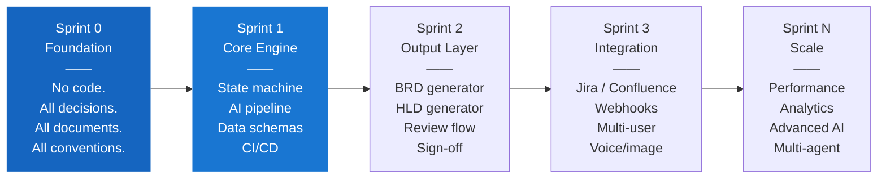

# PB-05 — Sprint Design

**Version:** v0.1
**The question:** How do we sequence the build — what goes in which sprint, how do we define done, and what conventions keep the team coherent?
**When to use:** After discovery and architecture are settled. Sprint design is the bridge between "what we decided" and "what we build."

---

## The Sprint Model for Agentic Systems

Agentic systems have a different build sequence than standard web apps. The AI pipeline, the state machine, and the API gateway are not equally difficult or equally risky. Sequence them wrong and you spend Sprint 2 rebuilding Sprint 1.



**The rule:** Nothing in Sprint 1 that was not decided in Sprint 0. No Sprint 2 features in Sprint 1.

---

## Sprint 0 Template

Sprint 0 is entirely documents. It produces decisions, not software. A Sprint 0 that produces code is a Sprint 0 that skipped decisions.

### Sprint 0 Canonical Documents

Every agentic product Sprint 0 must produce these seven documents:

```
SPRINT 0 — CANONICAL OUTPUT
------------------------------

1. BA_HITL_FLOW.md        — The phase-by-phase conversation protocol.
                            What happens in each phase. What checkpoints exist.
                            Exit criteria per phase.

2. ARCHITECTURE.md        — Trust model, confidence scoring, conflict protocol,
                            epistemic rules, engineering invariants.

3. DECISIONS.md           — Every architectural decision.
                            Format: question → decision → alternatives → rationale.
                            Status: DECIDED or DEFERRED. Nothing left OPEN.

4. TECH_STACK.md          — Language choices, library versions, gRPC interfaces,
                            repo structure, local development setup.

5. ONTOLOGY.md            — Complete entity schemas and relationships.
                            What is a Session? A Requirement? An Actor?
                            How do they relate?

6. DATABASE.md            — Physical schema, RLS policies, vector index config,
                            Redis design, S3 structure, migration strategy.

7. sprint0/README.md      — Sprint 0 summary: what was decided, why Sprint 0 is
                            closed, how it connects to Sprint 1.
```

### Sprint 0 Exit Criteria

```
SPRINT 0 EXIT CHECKLIST
--------------------------

[ ] All decisions in DECISIONS.md have status DECIDED or DEFERRED
    (No OPEN decisions — an open decision is an unresolved risk)
[ ] BA_HITL_FLOW.md reviewed and confirmed by BA team lead
[ ] ARCHITECTURE.md ratified by engineering lead
[ ] ONTOLOGY.md validated — every entity used in BA_HITL_FLOW.md exists in ONTOLOGY.md
[ ] TECH_STACK.md reviewed — library choices confirmed, no version ranges (pin everything)
[ ] DATABASE.md reviewed — schema confirmed, RLS strategy documented
[ ] Local development setup works — at least one engineer has followed the setup guide
[ ] No feature work has been started — Sprint 0 output is documents only
[ ] sprint0/README.md is complete and declares sprint CLOSED
```

---

## Sprint 1 Template

Sprint 1 builds the core engine — the state machine and the AI pipeline. These two components are the riskiest and must be proven before any output layer (BRD, HLD) is built on top of them.

### Sprint 1 Priorities

```
SPRINT 1 — EPIC LADDER
------------------------

P1 (must-have for any Sprint 1 exit):
  EPIC-1: State machine compiles and all AC evaluators pass tests
  EPIC-2: LangGraph pipeline executes end-to-end with stubs (no live LLM required)
  EPIC-3: Database schemas applied; hybrid search returns ranked results

P2 (complete in Sprint 1 if P1 is done):
  EPIC-4: Live LLM integration — real IntentClassifier + EntityExtractor
  EPIC-5: Document ingestion pipeline — upload → chunk → embed → index
  EPIC-6: Go API gateway — WebSocket + REST + JWT middleware

P3 (Sprint 1 stretch or Sprint 2):
  EPIC-7: BRD draft generation (requires P1 + P2 complete)
  EPIC-8: End-to-end BA session from Phase 1 to Phase 4 without manual intervention
```

### Sprint 1 Exit Criteria

```
SPRINT 1 EXIT CHECKLIST
--------------------------

[ ] A new BA session can move from Problem Intake through all four phases by conversation alone
[ ] The system asks exactly one next question or transition offer at the end of every turn
[ ] A document uploaded at a checkpoint is indexed and retrievable within the same session
[ ] Requirements sourced from uploaded documents carry traceable provenance (source chunk + page)
[ ] A session in a regulated domain cannot close Phase 3 without at least one uploaded document
    or an explicit BA waiver
[ ] REVISIT requests correctly re-enter the prior phase without losing any captured data
[ ] All tests pass in CI (unit, integration — Rust + Python)
[ ] cargo clippy passes with zero warnings
[ ] mypy --strict passes on the Python service
```

---

## Conventions Protocol

### Commit Format

All commits must follow Conventional Commits:

```
<type>(<scope>): <short description>

Types: feat | fix | docs | style | refactor | perf | test | chore
Scope: state-machine | ai-orchestration | api-gateway | proto | docs | ci

Examples:
  feat(state-machine): add AC evaluator for CONSTRAINT_CAPTURE phase
  fix(ai-orchestration): retry LLM call on rate limit with exponential backoff
  docs(playbooks): add PB-05 sprint design
  chore(ci): add Python black formatting check

Breaking changes: append ! to the type
  feat(proto)!: rename TurnRequest field
```

### Branch Naming

```
feat/sprint-N-short-description        New feature work
fix/issue-id-short-description         Bug fix
chore/short-description                Non-feature, non-fix (deps, tooling)
docs/short-description                 Documentation only
```

### PR Checklist Template

```
PULL REQUEST CHECKLIST
-----------------------

Before opening a PR, confirm all that apply:

General:
[ ] Branch name follows naming convention
[ ] All commits follow Conventional Commits format
[ ] No console.log / println! / fmt.Println in production code paths
[ ] No hardcoded model IDs — all model references point to pinned config values
[ ] No hardcoded credentials or API keys (check .env is gitignored)

Rust:
[ ] cargo clippy -- -D warnings passes with zero warnings
[ ] cargo fmt --check passes (CI will reject otherwise)
[ ] cargo test passes — all tests green

Python:
[ ] black --check . passes
[ ] isort --check . passes
[ ] mypy --strict src/ passes
[ ] pytest passes

Go:
[ ] go vet ./... passes
[ ] staticcheck ./... passes
[ ] go test ./... passes

Proto changes (if any):
[ ] Generated stubs regenerated for all three languages
[ ] All three stub files committed together in one commit
[ ] No existing field removed or renumbered

Documentation:
[ ] DECISIONS.md updated if a new architectural decision was made
[ ] Tech doc updated if service interface changed
[ ] Sprint README updated if new AC criterion was added
```

---

## The Session Definition of Done

Every user story or task in this system needs a consistent "definition of done." Copy this and customise:

```
DEFINITION OF DONE — [Project name]
-------------------------------------

A feature is DONE when:
1. It works in the happy path (manual test or automated test exists)
2. It handles the primary error case (with appropriate error message or fallback)
3. It is covered by at least one automated test
4. It passes all CI checks (lint, type check, tests)
5. It is documented in the relevant tech doc or sprint README
6. It has been reviewed by one other team member
7. It does not introduce any new compiler warnings
```

---

## Sprint Retrospective Prompt

Use these prompts at the end of every sprint:

```
SPRINT RETROSPECTIVE
---------------------

1. Which decision made in Sprint 0 turned out to be wrong? How do we record and correct it?
2. Which AC criterion was too strict, too loose, or ambiguous? Fix it for Sprint 2.
3. Which convention was violated most often? Why? Is the convention wrong or was the team wrong?
4. What did we build that we should not have built yet? What was the real sprint 1 work?
5. What are the three most important decisions for Sprint 2 that we have not made yet?
```

---

## What Goes Wrong Without This

| Skipped step | Typical consequence | When it surfaces |
|---|---|---|
| Sprint 0 not truly closed (open decisions) | Architectural disagreements resurface mid-sprint | Sprint 1 week 2 |
| No exit criteria | Sprint "completes" but core engine is not proven | Sprint 2 planning |
| No commit conventions | Git history is unreadable; changelogs are impossible | Any post-Sprint 1 audit |
| No PR checklist | Broken CI committed to main; unblocks team for 2 hours | Sprint 1 multiple times |
| Priorities not defined | Team works on BRD generation before state machine is stable | Sprint 1 demo |

---

## Chitragupt Decision

> **How we structured Chitragupt's sprints:**
> Sprint 0 produced all seven canonical documents and was formally CLOSED before any code was written. Sprint 1 priorities: state machine first (P1), AI pipeline with live LLMs second (P2), BRD generation deferred to Sprint 2 (P3). Conventional Commits enforced in CI. Cargo fmt and clippy failures block merge.
> Reference: `docs/sprints/sprint0/README.md`, `docs/sprints/sprint1/README.md`, `CONTRIBUTING.md`.

---

> Chitragupt Playbooks · PB-05 Sprint Design · v0.1 · May 2026
