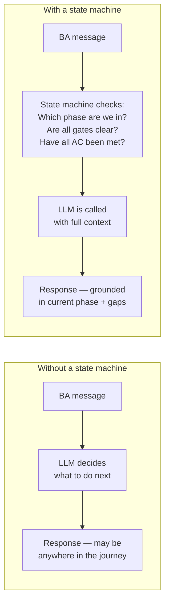
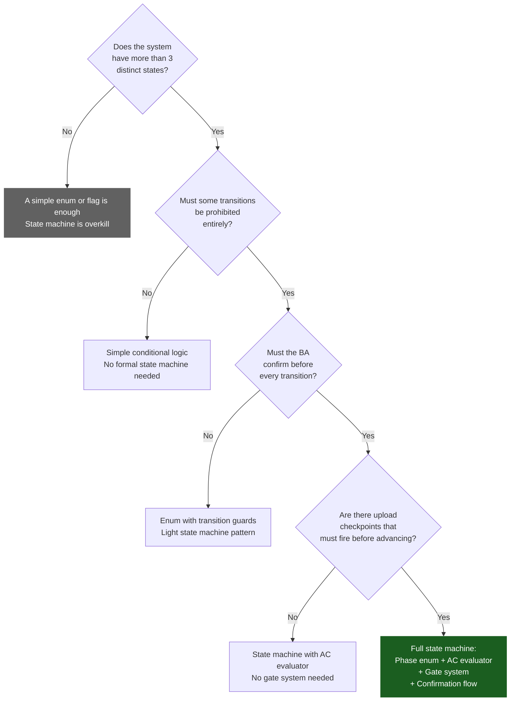
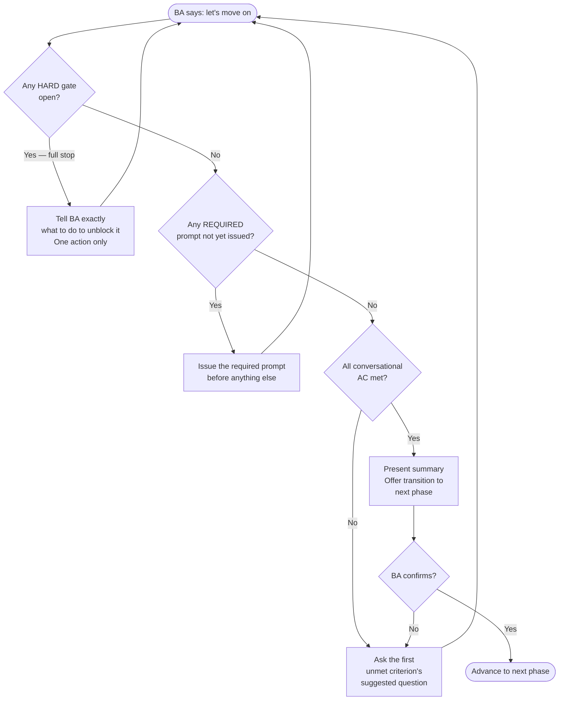
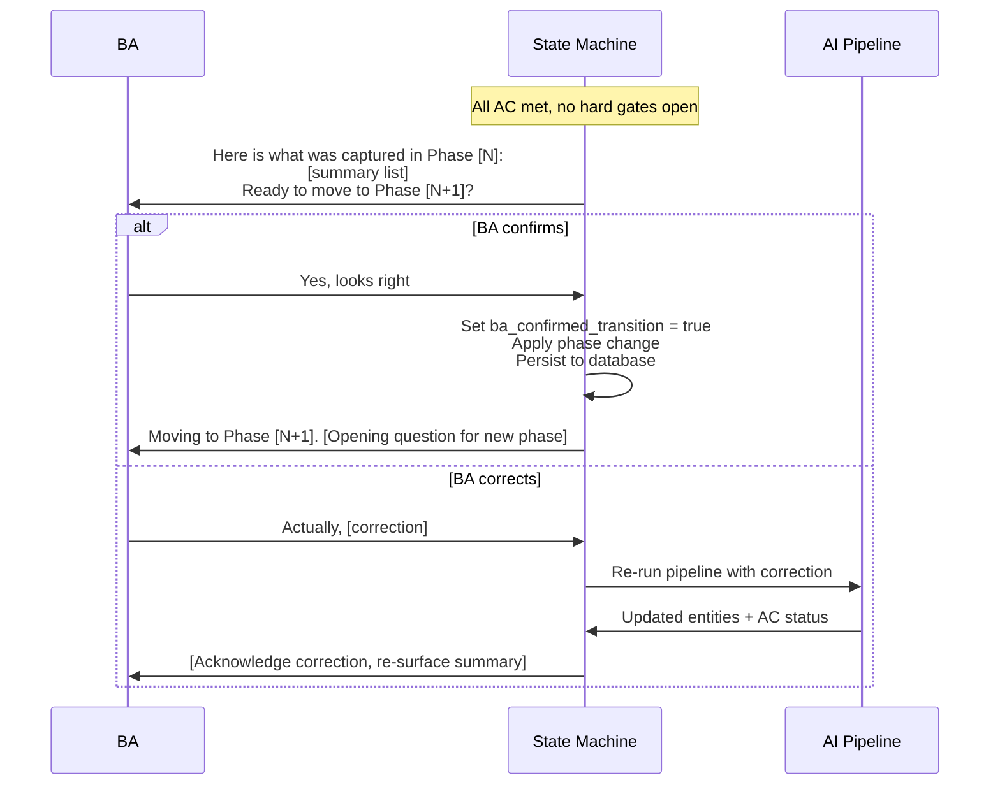
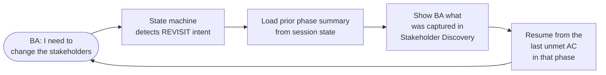

# PB-06 — State Machine & HITL Design

**Version:** v0.1
**The question:** How do we model the user's journey with hard guarantees — so the system can never end up in an invalid state, and the BA always knows exactly where they are?
**When to use:** Sprint 0 (design) and Sprint 1 (implementation). This is the most technically significant architectural decision in an agentic BA system.

---

## Why You Need a State Machine

An agentic system without a state machine is a chatbot. It can answer questions. It cannot guide a structured process with enforced checkpoints.

The difference is this: a state machine defines what phases exist, what transitions are valid, and what conditions must be true before a transition is offered. Without it, the AI can advance the session wherever the last LLM call leads — which may or may not be the right place.



**The state machine runs first, every time. The LLM is only called if the state machine clears it.**

---

## When to Use a State Machine vs a Simple Flag



---

## Phase Design Pattern

Every phase is a value in an enum. The enum is the complete and exhaustive list of valid states. If a state does not appear in the enum, it cannot exist.

### Phase Definition Template

```rust
// In Rust — compile-time exhaustive matching
pub enum SessionPhase {
    ProblemIntake,
    StakeholderDiscovery,
    RequirementElicitation,
    ConstraintCapture,
    ArchitectureAlignment,
    ReviewAndSignOff,
    SignedOff,   // Terminal — no outgoing transitions
}

// Every match on SessionPhase must handle all variants.
// Missing a variant = compile error. Not a runtime error. A compile error.
```

```python
# In Python — runtime enum (weaker, but usable)
from enum import Enum
class SessionPhase(str, Enum):
    PROBLEM_INTAKE           = "ProblemIntake"
    STAKEHOLDER_DISCOVERY    = "StakeholderDiscovery"
    REQUIREMENT_ELICITATION  = "RequirementElicitation"
    CONSTRAINT_CAPTURE       = "ConstraintCapture"
    ARCHITECTURE_ALIGNMENT   = "ArchitectureAlignment"
    REVIEW_AND_SIGN_OFF      = "ReviewAndSignOff"
    SIGNED_OFF               = "SignedOff"
```

### Phase Transition Map Template

```
PHASE TRANSITION MAP — [Project name]
---------------------------------------

Phase → Allowed Next Phases:

ProblemIntake           → [StakeholderDiscovery]
StakeholderDiscovery    → [RequirementElicitation]
RequirementElicitation  → [ConstraintCapture]
ConstraintCapture       → [ArchitectureAlignment]
ArchitectureAlignment   → [ReviewAndSignOff]
ReviewAndSignOff        → [SignedOff, RequirementElicitation]  ← revision loop
SignedOff               → []  ← terminal

RULE: Any transition not in this map is rejected by the TransitionEngine.
      A BA cannot "skip" to SignedOff from ConstraintCapture.
```

---

## Acceptance Criteria Design

AC criteria are the programmatic definition of "done" for each phase. Each criterion maps to a specific check on the session state — not a fuzzy LLM judgment.

### AC Criterion Pattern

Every criterion has four parts:

```
AC-[PHASE]-[NUMBER]   Unique ID for this criterion
Description           Plain-language statement of what must be true
Condition             Programmatic check on SessionState fields
Suggested question    The exact question to ask the BA if this criterion is unmet
```

### AC Template for One Phase

```
PHASE: [Phase name]
TRANSITION TO: [Next phase]

CONVERSATIONAL CRITERIA (must all be met — cannot be waived):

AC-S[N]-01  [Plain-language description]
            Condition: state.[field].[check]
            If unmet: "[Exact question to ask]"

AC-S[N]-02  [Plain-language description]
            Condition: state.[field].[check]
            If unmet: "[Exact question to ask]"

UPLOAD CRITERIA (optional — can be waived with explicit BA acknowledgment):

AC-S[N]-U1  [Plain-language description] (optional)
            Condition: state.documents_indexed.len() > 0 OR state.[waiver_flag]
            If unmet: "[Exact upload prompt to show]"
```

### Example: Problem Intake Phase

```
PHASE: ProblemIntake
TRANSITION TO: StakeholderDiscovery

AC-S1-01  Problem statement captured (minimum 50 words)
          Condition: state.problem_statement word count ≥ 50
          If unmet: "Can you describe the business problem in a few sentences? The more detail, the better."

AC-S1-02  Business domain identified
          Condition: state.business_domain is not null
          If unmet: "What industry or business domain does this project operate in?"

AC-S1-03  Primary success metric articulated
          Condition: state.definition_of_success is not null
          If unmet: "What does success look like for this project? How will you know in 6 months that it worked?"

AC-S1-04  At least one pain point captured
          Condition: state.pain_points is not empty
          If unmet: "What is the biggest frustration in the current process that this system will fix?"

AC-S1-05  Scope boundary stated
          Condition: state.scope_boundary_stated = true
          If unmet: "Are there things you already know are explicitly out of scope for this project?"

AC-S1-U1  [OPTIONAL] Existing documentation uploaded
          Condition: state.documents_indexed not empty OR state.memory_only_waiver = true
          If unmet: "Do you have any existing documentation — a brief, a deck, or previous specs — you'd like to share?"
```

---

## Gate Design

Gates enforce checkpoints that AC criteria cannot — specifically, upload requirements and external approvals.



### Gate Type Template

```
GATE INVENTORY — [Project name]
---------------------------------

| Gate ID | Type | Transition guarded | Condition | How to resolve |
|---|---|---|---|---|
| GATE-BRD-EXISTS | HARD | Review → SignedOff | brd_artifact_id is null | Generate BRD automatically |
| GATE-CLIENT-SIG | HARD | Review → SignedOff | client_signature_confirmed = false | Dispatch sign-off token to client email |
| GATE-REG-SOURCE | HARD | Elicitation → Constraints | regulated_domain = true AND no documents | Upload at least one document OR record explicit waiver |
| GATE-ORG-CHART | REQUIRED_PROMPT | Stakeholders → Elicitation | checkpoint_a_prompted = false | Ask: "Do you have an org chart or RACI matrix you can share?" |
| GATE-WIREFRAMES | TRIGGERED | Elicitation → Constraints | BA mentioned "screen" or "UI" | Ask: "You mentioned UI requirements — do you have wireframes?" |
```

---

## HITL Confirmation Flow

Even when all AC are met and all gates are clear, the BA must confirm before the session advances. The system never silently changes phase.



**The state is not written until confirmation arrives. The pipeline sets `transition_pending = true` and waits. Only a CONFIRM intent commits the transition.**

---

## REVISIT Flow

The BA can return to any prior phase at any time. Nothing captured is lost.



**No data is deleted on REVISIT. The session re-enters the phase and continues from the last unanswered gap.**

---

## State Machine Implementation Checklist

```
STATE MACHINE DESIGN SIGN-OFF
-------------------------------

Phases:
[ ] All phases defined as an enum (Rust) or Enum class (Python)
[ ] Terminal phase identified (no outgoing transitions)
[ ] Transition map is explicit — all valid transitions listed, all others prohibited
[ ] REVISIT transitions designed (which phases can be re-entered)

AC System:
[ ] Every phase has an AC evaluator function
[ ] Every AC criterion has: ID, description, programmatic condition, suggested question
[ ] Optional criteria (upload-related) use separate check_optional() call
[ ] AC gaps are ordered by priority — first gap = next question for LLM

Gate System:
[ ] Hard gates identified — conditions with no workaround listed
[ ] Required prompts identified — questions that must be asked once per session
[ ] Triggered gates identified — upload prompts triggered by BA keywords
[ ] Gate evaluation order documented: HARD → REQUIRED → TRIGGERED → AC

Confirmation Flow:
[ ] Transition requires explicit BA confirm before phase change is committed
[ ] Pending transition state is tracked in SessionState (not committed until confirmed)
[ ] REVISIT intent detected and routed to prior-phase resumption

Testing:
[ ] Unit tests: every AC criterion passes with valid state, fails with invalid state
[ ] Integration tests: every gate fires correctly and blocks transition
[ ] Integration tests: every valid transition succeeds when all conditions met
[ ] Integration tests: every invalid transition is rejected
```

---

## What Goes Wrong Without This

| Skipped design | Typical consequence | When it surfaces |
|---|---|---|
| No transition map | LLM advances session to ReviewAndSignOff in turn 3 | First BA demo |
| No BA confirmation step | BA complains "I didn't agree to move on" | Sprint 1 UAT |
| Fuzzy AC (LLM-evaluated) | Criteria pass inconsistently; session advances on partial information | Sprint 2 regression |
| No hard gates | BRD generated without a client signature; signed-off session has no proof | Client delivery |
| No REVISIT handling | BA says "go back" and nothing happens — or all data is lost | Sprint 1 UAT |

---

## Chitragupt Decision

> **How we designed the Chitragupt state machine:**
> Seven phases as a Rust enum — the compiler enforces exhaustive matching at every match expression. AC evaluators in `src/ac/s1.rs` through `s6.rs`, each returning an `AcResult` with a priority-ordered `gaps` vector. Four gate types (Hard, RequiredPrompt, Triggered, Recommended) in `src/gates/manager.rs`. Three-condition `TransitionEngine::attempt()` (valid target + gates clear + AC met). BA confirmation required before committing any transition. REVISIT is handled by detecting REVISIT intent in the IntentClassifier and re-entering the prior phase from the last unmet gap.
> Reference: `docs/tech-docs/state-machine.md`, `services/state-machine/src/`.

---

> Chitragupt Playbooks · PB-06 State Machine & HITL · v0.1 · May 2026
