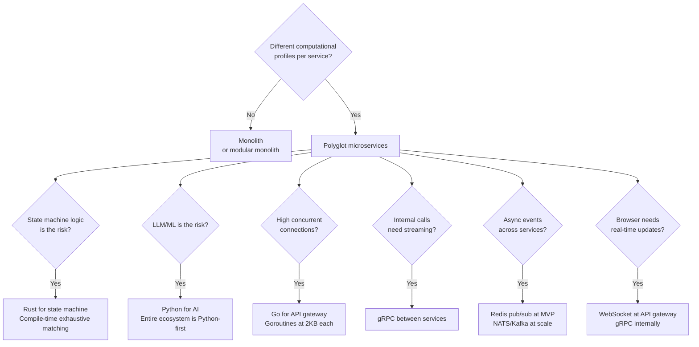

# PB-08 — Master Cheat Sheet

**Version:** v0.1
**The question:** What is the fastest answer to the decision in front of me right now?
**When to use:** Anytime. This page is the single-page reference for all key decisions in these playbooks.

---

## 1. Are We Ready to Move to the Next Phase?

Run this checklist before calling any sprint "complete."

### Sprint 0 → Sprint 1 Gate

```
[ ] All 7 canonical documents exist in docs/sprints/sprint0/
[ ] Every decision in DECISIONS.md is DECIDED or DEFERRED (nothing OPEN)
[ ] BA_HITL_FLOW.md confirmed by BA team
[ ] TECH_STACK.md: all model IDs pinned, all library versions pinned
[ ] DATABASE.md: schema confirmed, RLS strategy documented
[ ] Local dev setup works (at least one engineer ran it end-to-end)
[ ] CI pipeline exists and is green on main
[ ] No feature code written yet
```

### Sprint 1 → Sprint 2 Gate

```
[ ] State machine: cargo test green, all AC evaluators tested +/-
[ ] AI pipeline: end-to-end LangGraph run works (live or stubbed LLM)
[ ] Database: schema applied, hybrid search returns results
[ ] A BA session can move Phase 1 → Phase 4 by conversation alone
[ ] System surfaces exactly one next question per turn, always
[ ] Uploaded documents are retrievable within the same session
[ ] REVISIT works without losing captured data
[ ] CI green on all three services
```

---

## 2. Architecture Decision Tree



---

## 3. Model Tier Selector

Use this table to assign an LLM tier to every AI function in the system.

| Function type | Tier | Why | Example model |
|---|---|---|---|
| Intent classification | **Fast** | Binary decision; speed matters | `claude-haiku-4-5-20251001` |
| Routing / tagging | **Fast** | Simple pattern matching | `claude-haiku-4-5-20251001` |
| Entity extraction | **Standard** | Structured reasoning over context | `claude-sonnet-4-6` |
| Gap analysis | **Standard** | Reasoning over session state | `claude-sonnet-4-6` |
| Requirement refinement | **Standard** | Cross-reference + synthesis | `claude-sonnet-4-6` |
| BRD / HLD generation | **Premium** | Long-form, high-stakes output | `claude-opus-4-7` |
| Document chunking | **Fast** | Boundary detection is rule-based mostly | `claude-haiku-4-5-20251001` |
| Semantic search | **Embedding** | Vectors, not language | `voyage-large-2` |
| Audio transcription | **Modal** | Specialized modality | `whisper-1` |

**Never use Premium for classification. Never use Fast for final deliverables.**

---

## 4. Storage Type Selector

| Data | Store in | Key rule |
|---|---|---|
| Session state (phase, entities, AC) | PostgreSQL JSONB | Atomic write per turn; cache in Redis |
| Uploaded documents (raw files) | S3 / R2 | Tenant-prefixed keys; presigned URLs only |
| Document text chunks + embeddings | pgvector (PostgreSQL) | HNSW index; namespace by tenant+project |
| Active session cache | Redis (TTL: 5 min) | Refreshed on every write; no TTL = memory leak |
| Rate limit counters | Redis (TTL: window) | Per-tenant, not per-IP |
| Audit trail | PostgreSQL append-only | Never UPDATE — only INSERT |
| LLM cost log | PostgreSQL | Per-call record; rollup to session + project |
| User PII | PostgreSQL + encrypted | Right to erasure must be implementable |

---

## 5. Gate Type Selector

| Situation | Gate type | Behaviour |
|---|---|---|
| BRD must exist before client can sign | **HARD** | Blocks transition entirely; no workaround |
| Client signature required | **HARD** | External token must be returned |
| Regulated domain with no source doc | **HARD** | Must upload OR record explicit waiver |
| System must ask about org chart once | **REQUIRED PROMPT** | Question must be issued; BA may say no |
| BA mentioned "UI" — ask about wireframes | **TRIGGERED** | Ask once when trigger fires; BA may decline |
| Would be nice to have a timeline doc | **RECOMMENDED** | Suggest once; no consequence if ignored |

---

## 6. Budget Threshold Design

Customise the dollar amounts. The tier degradation pattern is fixed.

```
$0.00 → CAUTION threshold ($X.XX)   ← Normal operation (full model tiers)
$X.XX → CRITICAL threshold ($Y.YY)  ← Caution: premium → standard; notify BA once
$Y.YY → HARD LIMIT ($Z.ZZ)          ← Critical: standard → fast; notify BA again
$Z.ZZ → EXHAUSTED                   ← Hard limit: all LLM calls blocked

QUALITY FLOOR: Final-output functions (BRD, HLD) never degrade below STANDARD.
               Using Haiku for a client deliverable is unacceptable.
```

---

## 7. The One-Page Sprint 0 Checklist

```
SPRINT 0 — ONE PAGE
--------------------

DISCOVERY (PB-01):
[ ] Problem statement: ≥ 50 words, no solution named
[ ] Decision-maker: name + role identified
[ ] Success: measurable definition captured
[ ] Unknowns register: ≥ 5 items, all with owners + due dates

ARCHITECTURE (PB-02):
[ ] Service responsibility matrix: every concern has one owner
[ ] Communication protocol decided: gRPC / REST / WebSocket / events
[ ] Trust hierarchy defined: 5 levels, lower cannot overwrite higher
[ ] All 14 architectural decisions: status DECIDED or DEFERRED

AI STRATEGY (PB-03):
[ ] LLM function inventory: every function listed
[ ] Model tier assigned: every function has pinned model ID
[ ] Fallback model: every primary has a cross-vendor fallback
[ ] Budget thresholds: caution, critical, hard limit, quality floor

DATA (PB-04):
[ ] Storage type assigned for each data class
[ ] RLS enabled on all tenant tables
[ ] Embedding model + dimension locked (changing requires full re-embed)
[ ] Redis TTL defined for every key type

CONVENTIONS (PB-05):
[ ] Commit format: Conventional Commits
[ ] Branch naming: feat/fix/chore/docs
[ ] PR checklist: lint + format + type check + tests
[ ] Definition of Done documented
```

---

## 8. The One-Page Sprint 1 Checklist

```
SPRINT 1 — ONE PAGE
--------------------

RUST STATE MACHINE (PB-06):
[ ] Phase enum: all phases, transitions mapped, terminal identified
[ ] AC evaluators: one per phase, all criteria with IDs + suggested questions
[ ] Gate inventory: HARD / REQUIRED / TRIGGERED / RECOMMENDED all listed
[ ] TransitionEngine: 3-condition (valid + gates clear + AC met)
[ ] BA confirmation flow: transition pending until BA confirms
[ ] REVISIT flow: re-enters prior phase without losing data
[ ] Tests: every AC criterion passes + fails correctly; every gate fires

PYTHON AI PIPELINE (PB-03, PB-07):
[ ] LangGraph pipeline: 5 nodes, linear, compiled at startup
[ ] All nodes implement PipelineNode ABC (no-raise contract)
[ ] LLMFactory: lazy loading, budget degradation, circuit breaker
[ ] Streaming: token queue wired; first token < 2s after LLM starts
[ ] Ingestion: upload → chunk → embed → index → Redis event → Rust gate resolve

DATA (PB-04):
[ ] PostgreSQL schema applied with migrations
[ ] pgvector HNSW index on chunks table
[ ] Redis cache: session state with 5-min TTL

CI (PB-07):
[ ] GitHub Actions: Rust + Python + Go jobs in parallel
[ ] cargo fmt + clippy + test all pass
[ ] mypy --strict + pytest pass
[ ] Branch protection: merge requires green CI
```

---

## 9. Common Failure Modes — Quick Diagnosis

| Symptom | Probable cause | Where to look |
|---|---|---|
| Session advances without BA confirming | `ba_confirmed_transition` flag not checked before phase change | `TransitionEngine::attempt()` |
| LLM response does not match current phase | SessionState not passed to AI pipeline | `PipelineState.session_state` input |
| Two sessions share data | `tenant_id` missing from a database query | All repository functions |
| Cost spikes in production | Premium tier used where Fast would do | `function_map` in `orchestration.yaml` |
| Retrieval returns irrelevant chunks | Embedding model changed without re-indexing | `chunks.embedding` dimension mismatch |
| CI passes locally but fails in CI | Toolchain version mismatch | `rust-toolchain.toml`, `uv.lock`, `go.sum` |
| Gate fires on every turn | Gate condition not cleared after resolution | `GateManager.all_gates_for_session()` |
| BA stuck in same phase | AC criterion condition always false | `src/ac/s[N].rs` condition logic |

---

## 10. The Five Principles (Always True)

These are not guidelines. They are invariants.

1. **Sprint 0 produces decisions, not code.** If a line of production code was written in Sprint 0, Sprint 0 did not happen — it was Sprint 1 without decisions.

2. **One question per turn.** Every system response ends with exactly one action for the BA. Not zero. Not two. One.

3. **All information traces to a source.** A requirement with no source is a guess dressed as a commitment. Orphan knowledge is excluded from the BRD.

4. **State machine runs before LLM.** Gates and AC are evaluated synchronously in pure logic. The LLM is not consulted on whether a transition should happen — only on what to say next.

5. **Multi-tenancy is a constraint, not a feature.** Every query, every cache key, every S3 path includes `tenant_id` from the start. Retrofitting multi-tenancy is a rewrite.

---

> Chitragupt Playbooks · PB-08 Master Cheat Sheet · v0.1 · May 2026
