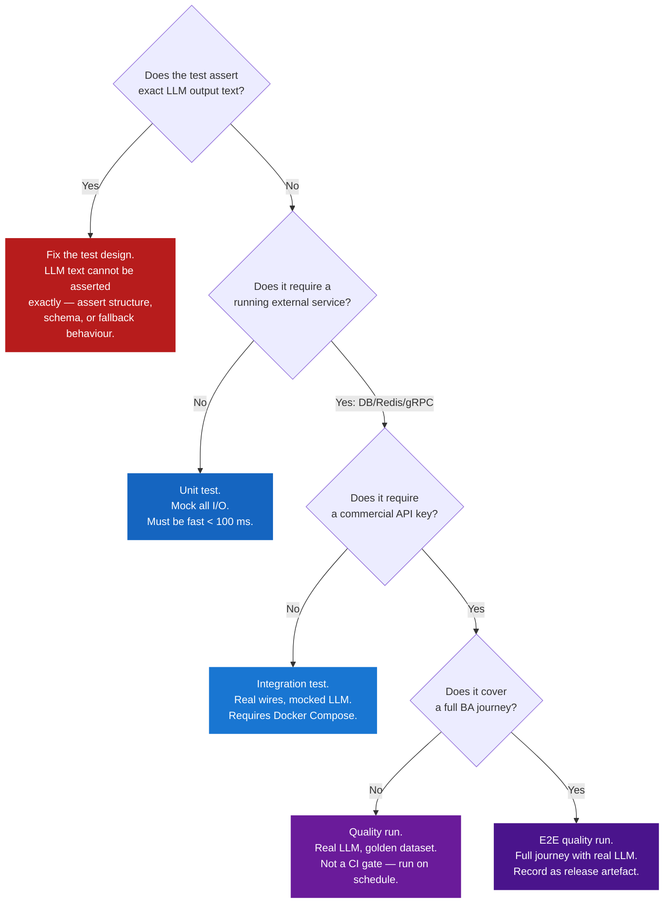

# PB-09 — Testing Strategy & Quality Assurance

**Version:** v0.1  
**The question:** How do we know the system actually works — what tests do we write, in what order, and what does "green" mean for a system where some of the logic runs inside a language model?  
**When to use:** Sprint 1 (initial test suite), any sprint where new nodes, state transitions, or service boundaries are added. Test strategy is a design decision, not an afterthought.

---

## Why Agentic Testing Is Different

A standard web application has two failure modes: the code is wrong, or the infrastructure is down. An agentic system has four:

1. The code is wrong.
2. The LLM returned unexpected output.
3. The state machine allowed a transition it should have blocked.
4. The output was technically valid but useless to the BA.

Standard testing covers failure mode 1. Agentic testing must cover all four.

The key insight is that **LLM calls are not testable as black boxes**. You cannot write a test that asserts "the LLM will say this exact sentence." Instead, you test the system at three seams:

- **Before the LLM call:** Was the prompt constructed correctly? Were the right inputs passed?
- **After the LLM call (mocked):** Does the parsing logic handle every possible response shape?
- **Periodically with a real LLM:** Does the output quality meet the BA's needs?

These three seams map to three test types: unit (mocked), integration (mocked + real wires), and quality (real LLM, not in CI).

---

## The Three Quality Dimensions

Every test in this system answers one of three questions:

| Dimension | Question | Tested by |
|---|---|---|
| **Correctness** | Does the code do what the spec says? | Unit + Integration tests |
| **Safety** | Does a wrong input or service failure leave the system in a bad state? | Edge case + State boundary tests |
| **Quality** | Does the output actually serve the BA well? | Quality + E2E tests with real LLM |

Write correctness and safety tests first — they are fast, cheap, and block CI. Write quality tests second — they are slow, require API keys, and run on a schedule.

---

## The Nine Testing Domains

For each agentic product, cover these nine domains. Not all domains apply equally at every sprint — the Priority column indicates Sprint 1 ordering.

| # | Domain | Question it answers | Priority |
|---|---|---|---|
| 1 | **LLM Determinism** | Does identical input always produce identical structured output? | Sprint 1 |
| 2 | **Edge Cases** | Does the system degrade gracefully for every bad input? | Sprint 1 |
| 3 | **Quality of Response** | Is the text the BA sees accurate, grammatical, and free of leakage? | Sprint 1 (periodic) |
| 4 | **State Boundaries & Gating** | Is every gate tested at exactly its threshold? | Sprint 1 |
| 5 | **Code Correctness** | Do all non-LLM functions (parsers, chunkers, serialisers) compute correct values? | Sprint 1 |
| 6 | **Code Integration** | Do all service boundaries communicate correctly with real wire protocol? | Sprint 1 |
| 7 | **Latency** | Does every critical path meet its latency budget? | Sprint 1 |
| 8 | **Context Awareness** | Does the system use the right context at every step? | Sprint 1 |
| 9 | **Budget & Commercial** | Is every dollar of LLM spend tracked, accumulated, and fault-tolerant? | Sprint 1 |

The full test catalogue (101 tests across all nine domains) is in [`docs/sprints/sprint1/TEST_PLAN.md`](../sprints/sprint1/TEST_PLAN.md).

---

## The Coverage Pyramid for Agentic Systems

The coverage pyramid for agentic systems has four levels, not three. The fourth level — quality runs with a live LLM — does not belong in CI; it runs on a schedule or before major releases.

```
        ┌─────────────────────────────┐
        │         E2E Tests           │  Few. Full journey. Real stack.
        │    (full BA conversation)   │  Run on every merge to main.
        ├─────────────────────────────┤
        │     Integration Tests       │  Some. Real services, mocked LLM.
        │  (gRPC + DB + Redis wires)  │  Run on every merge to main.
        ├─────────────────────────────┤
        │        Unit Tests           │  Many. All I/O mocked.
        │  (single function/node)     │  Run on every push.
        ├─────────────────────────────┤
        │       Quality Runs          │  Few. Real LLM. Requires API keys.
        │  (golden dataset + latency) │  Run on schedule / pre-release.
        └─────────────────────────────┘
```

**Rule of thumb:** If a test requires a running external service (DB, Redis, gRPC), it is integration or E2E. If it requires an API key to a commercial LLM, it is a quality run. Quality runs are never CI gates — they run separately and results are recorded as artefacts.

---

## Test Writing Decision Tree

When writing a new test, use this decision tree to determine the correct type.



---

## How to Test LLM Calls Without a Live LLM

This is the most common question when building an agentic test suite. The answer is: test the seams, not the model.

### Pattern 1 — Mock the LLM client, test the parser

```python
# What you are testing: does malformed JSON fall back correctly?
# What you are NOT testing: does Haiku return correct intent?

async def test_intent_classifier_falls_back_on_malformed_json():
    mock_response = MagicMock()
    mock_response.content = [MagicMock(text="not valid json at all")]

    with patch.object(classifier._client, "messages", create=True) as mock_client:
        mock_client.create = AsyncMock(return_value=mock_response)
        result = await classifier._classify(state=sample_state)

    assert result == "Clarification"    # fallback, not a crash
```

### Pattern 2 — Assert temperature=0, not the response content

```python
# What you are testing: is the LLM called with correct parameters?
# This catches regressions where temperature gets accidentally changed.

async def test_intent_classifier_uses_temperature_zero():
    with patch.object(classifier._client.messages, "create") as mock_create:
        mock_create.return_value = valid_intent_response("Answer")
        await classifier._classify(state=sample_state)

    call_kwargs = mock_create.call_args.kwargs
    assert call_kwargs["temperature"] == 0
```

### Pattern 3 — Assert the prompt, not the response

```python
# What you are testing: is the right phase prompt injected?
# This catches the Phase 2 prompt being used in Phase 3.

async def test_entity_extractor_uses_phase_3_prompt_in_elicitation():
    with patch.object(extractor._client.messages, "create") as mock_create:
        mock_create.return_value = valid_entity_response([])
        await extractor._extract(state={**base_state, "current_phase": "RequirementElicitation"})

    system_prompt = mock_create.call_args.kwargs["system"]
    assert "RequirementElicitation" in system_prompt
```

### Pattern 4 — Golden dataset for quality (not CI)

```python
# File: tests/integration/test_quality.py
# Marker: @pytest.mark.quality (not run in fast CI mode)

@pytest.mark.quality
async def test_intent_classification_precision_on_golden_dataset():
    utterances = load_fixture("golden_utterances.jsonl")
    correct = 0
    for item in utterances:
        result = await classifier_with_real_llm._classify(item["utterance"])
        if result == item["expected_intent"]:
            correct += 1
    precision = correct / len(utterances)
    assert precision >= 0.90, f"Precision {precision:.2f} below 0.90 threshold"
```

---

## State Boundary Testing Protocol

State machine boundaries are the most important correctness tests in the system. A gate that fires when it should not is a UX bug. A gate that does not fire when it should is a data integrity bug.

For every gate and every AC criterion, write three tests:

```
BOUNDARY TEST PROTOCOL
-----------------------

For each gate or AC criterion:

  1. TEST AT N-1 (one short)
     State is one condition away from passing.
     Assert: transition is BLOCKED or AC is UNMET.

  2. TEST AT N (threshold exactly met)
     State satisfies the condition exactly.
     Assert: transition is APPROVED or AC is MET.

  3. TEST WITH WAIVER (if criterion has -U optional suffix)
     Criterion is explicitly waived.
     Assert: criterion is WAIVED (not MET, not UNMET).
     Assert: transition_ready is TRUE (waived -U criteria do not block).
```

Example:

```
GATE: Regulated domain requires at least one uploaded document
      before Phase 3 → Phase 4 transition.

Test 1 (N-1): regulatory_context is set, documents_indexed is empty.
              → TransitionRequest returns approved=false.

Test 2 (N):   regulatory_context is set, documents_indexed has one entry.
              → TransitionRequest returns approved=true.

Test 3 (waiver): regulatory_context is set, AC-S3-U1 is in ac_waived.
                 → TransitionRequest returns approved=true.
```

---

## Latency Budget Design

Latency tests pass or fail against a numerical budget. The budget is not a guess — it is derived from the BA's experience expectation.

```
LATENCY BUDGET DERIVATION
--------------------------

1. Start from user expectation.
   A BA typing a message and waiting for a response:
   - < 3 s feels fast
   - 3–7 s is acceptable
   - > 7 s breaks focus

2. Allocate the budget across the call chain.
   For a ProcessTurn request with SSE streaming:

   Go HTTP parsing            < 5 ms
   Rust GetSessionState       < 10 ms
   Go → Python gRPC open      < 20 ms
   Python intent classify     < 800 ms    ← Haiku, temp=0
   Python entity extract      < 1 200 ms  ← Haiku, temp=0
   Python RAG retrieval       < 500 ms    ← pgvector + BM25
   Python gap analysis        < 1 500 ms  ← Sonnet, temp=0
   Python first guidance tok  < 600 ms    ← Sonnet streaming start
   ──────────────────────────────────────
   First token to BA          < 4 635 ms

3. Add 10% safety margin.
   Budget: first token < 5 000 ms (p95 over 10 trials).

4. Test at p95, not p50.
   p50 tells you the median. p95 tells you what your slowest users see.
   One in twenty turns exceeding the budget is unacceptable for a BA tool.
```

Latency tests are in the `latency` run mode. They require a warm Docker Compose stack and real API keys. They do not run in standard CI — they run as a scheduled job or before a release.

---

## Budget & Commercial Test Protocol

Every LLM call has a dollar cost. The test suite must verify that every dollar is:

1. **Counted** — recorded in Redis after the call completes.
2. **Accumulated** — Redis `INCRBYFLOAT` adds correctly across turns.
3. **Reported** — `cost_usd` in the SSE complete event matches the sum of all calls in that turn.
4. **Fault-tolerant** — Redis being unavailable does not break the pipeline.
5. **Precise** — no floating-point drift across a long session.

```python
# Template: budget unit test

async def test_budget_accumulates_correctly():
    tracker = BudgetTracker(session_id="s1", workspace_id="w1")
    costs = [0.001234, 0.000891, 0.002017]
    for c in costs:
        await tracker.record(c)
    total = await tracker.load()
    assert abs(total - sum(costs)) < 0.000001  # precision: 6 decimal places

async def test_budget_survives_redis_failure():
    tracker = BudgetTracker(session_id="s1", workspace_id="w1", redis=broken_redis)
    # Must not raise; pipeline must complete
    await tracker.record(0.005)
    total = await tracker.load()
    assert total == 0.0  # fallback: returns zero, does not crash
```

---

## SOP: How to Add a New Test

Use this template when adding any new test to the suite. Fill in all fields. An incomplete entry will be rejected in code review.

```
NEW TEST CHECKLIST
-------------------

Test ID:     T-[DOMAIN_CODE]-[NN]      (e.g. T-STATE-16)
Domain:      [one of the 9 domains]
Layer:       Unit / Integration / E2E / Quality
File:        [full path from repo root]

What it proves:
  [One sentence: "Assert that X happens when Y is true."]

What it does NOT prove:
  [One sentence: The boundary of what this test covers.]

Why this layer (not a different one):
  [ ] No external services needed  → Unit
  [ ] Real gRPC/DB/Redis needed    → Integration
  [ ] Real LLM needed              → Quality
  [ ] Full journey needed          → E2E

Mocking strategy:
  [List every external call that is mocked and what value it returns.]

Pass condition:
  [Exact assertion: the test passes when ____.]

Fail condition:
  [What the test would catch: this test would have caught ____ in production.]
```

---

## Run Modes and CI Integration

Tests are tagged with `pytest` markers. CI runs the `fast` mode on every push. The `quality` and `latency` modes run on a schedule or manually before a release.

| Mode | Command | Tests run | Needs API keys | When |
|---|---|---|---|---|
| `fast` | `pytest -m fast` | Unit + Integration (mocked LLM) | No | Every push |
| `quality` | `pytest -m quality` | Golden dataset + quality assertions | Yes | Scheduled (weekly) |
| `latency` | `pytest -m latency` | All latency budgets | Yes | Pre-release |
| `full` | `pytest` (no marker) | Everything | Yes | Major releases |

Marker declarations in `pyproject.toml`:

```toml
[tool.pytest.ini_options]
markers = [
    "fast: unit and mocked integration tests — no API keys required",
    "quality: real LLM calls against golden dataset — requires API keys",
    "latency: latency budget assertions — requires warm stack and API keys",
]
```

All unmarked tests run in every mode. Mark a test only when it requires an API key or a warm external stack.

---

## Sprint Closure: Test Exit Criteria

A sprint is not done when the code is written. It is done when the tests are green.

### Sprint 1 Test Closure Checklist (9 criteria)

```
SPRINT 1 — TEST SIGN-OFF
--------------------------

Original 5 exit criteria (verified by E2E tests):
[ ] 1. BA session moves Phase 1 → Phase 4 by conversation alone (T-E2E-01)
[ ] 2. Exactly one question or transition offer per turn, always (T-E2E-02)
[ ] 3. Document uploaded at Checkpoint B is indexed and provenance-traced (T-E2E-05)
[ ] 4. Regulated domain blocks Phase 3→4 without a document or waiver (T-E2E-03)
[ ] 5. REVISIT re-enters prior phase without losing captured data (T-E2E-04)

Expanded 4 exit criteria (verified by unit/integration tests):
[ ] 6. All node parsers produce identical output for identical mocked responses,
       3 runs, temperature=0 asserted in every call (T-DET-01 through T-DET-06)
[ ] 7. All 15 edge-case inputs handled without 5xx or unrecovered panic (T-EDGE-01..15)
[ ] 8. Budget accurate to 0.001 USD at 200 turns; Redis-down fallback works (T-BUD-*)
[ ] 9. p95 first-token SSE latency ≤ 5 000 ms under normal load (T-LAT-06)

Sign-off requires:
  - fast mode: all green in CI
  - latency mode: T-LAT-06 recorded as a release artefact (not required to be a CI gate)
  - quality mode: T-QUAL-01 and T-QUAL-02 recorded (not required to be a CI gate)
```

---

## What Goes Wrong Without This

| Skipped test | Typical consequence | When it surfaces |
|---|---|---|
| No LLM determinism tests | Parser regression ships to production; BA gets wrong intent on a valid message | First live session |
| No edge case tests for binary file upload | Server panic on DOCX uploaded without extension | First client demo |
| No state boundary tests at N-1 | Gate fires one turn too early or too late; BA advances without meeting AC | Sprint 2 handover |
| No budget tests with Redis down | Pipeline crashes in production when Redis restarts; every active session fails | First Redis maintenance window |
| Quality tests never run | LLM prompt regresses; precision drops from 0.91 to 0.73; nobody notices | Client sign-off meeting |
| Latency tests never run | A retrieval query that takes 4s locally is 12s in staging; first BA complains in UAT | UAT session |
| No cross-tenant isolation test | Session A retrieves chunks from Session B's uploaded documents | Security audit |
| Test suite run only in unit mode | Integration incompatibility between Go and Rust proto stubs ships | First Docker Compose run |

---

## Chitragupt Decision

> **How Chitragupt's test suite was designed:**  
> The original Block G test scope (10 tests across unit + integration + E2E) was expanded in Sprint 1 to 101 tests across nine domains after identifying that LLM determinism, edge case handling, latency budgets, and budget fault-tolerance were not covered. The expansion was driven by four lessons from the build:  
> (1) The `regulated_gate_met` condition was auto-true on a fresh session — caught only by a state boundary test at N-1.  
> (2) The `INCRBYFLOAT` Redis pattern for budget tracking had no fault-tolerance test — Redis going down would have crashed every active session.  
> (3) The Python gRPC servicer imported proto stubs with a try/except fallback — but the fallback was never tested.  
> (4) Latency was never measured — the RAG retrieval step had no budget, so slow queries went undetected.  
> Test catalogue: [`docs/sprints/sprint1/TEST_PLAN.md`](../sprints/sprint1/TEST_PLAN.md).

---

> Chitragupt Playbooks · PB-09 Testing Strategy & Quality Assurance · v0.1 · May 2026
