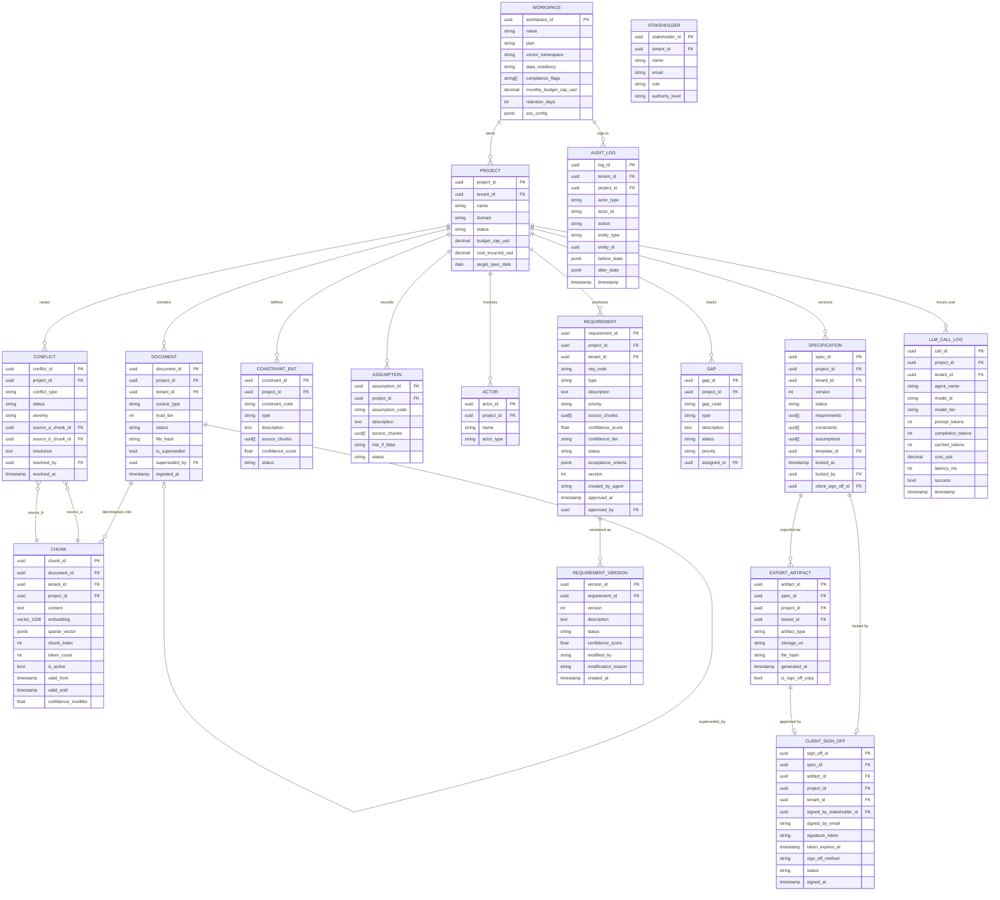

# Database Architecture — Chitragupt

**Version:** 2.0 — Sprint 0 Canonical (merged)
**Status:** Authoritative. Implements decisions D-005, D-006, D-007 from `DECISIONS.md`.
**Scope:** All three storage layers — structured (PostgreSQL), cached (Redis), object (S3/R2)
**Companion documents:**
- `ONTOLOGY.md` — canonical entity schemas and field definitions
- `TECH_STACK.md` — service ownership and gRPC communication model

---

## Overview

Chitragupt uses three purpose-built storage layers. Each layer handles a distinct class of data; no layer is a substitute for another.

| Layer | Technology | Purpose |
|---|---|---|
| **Structured + Vector** | PostgreSQL 16 + pgvector | All relational entities, vector embeddings, audit trail, cost logs |
| **Cache + Events** | Redis 7 | Session state hot cache, budget counters, pub/sub event bus |
| **Object Storage** | Cloudflare R2 (S3-compatible) | Raw uploaded documents, generated export artifacts |

All three services (Rust, Python, Go) connect to the same PostgreSQL and Redis instances. Each service uses its own connection pool and writes only to the tables it owns. No service reads from another service's tables directly — cross-service data access goes through gRPC.

---

## 1. Structured Storage — PostgreSQL 16 + pgvector

### 1.1 Why a Single PostgreSQL Instance (D-005)

Rather than splitting relational and vector storage into separate systems, all data lives in one PostgreSQL instance extended with `pgvector`. This means:

- **Unified RLS**: Row-level security policies enforcing `tenant_id` isolation are written once and apply consistently to every query — including vector similarity searches.
- **Transactional consistency**: When a document is ingested and its chunks are indexed, the document status update and the chunk inserts happen in the same transaction. There is no window where a document is marked `indexed` but its chunks are not yet visible.
- **Reduced operational surface**: One database to back up, replicate, and monitor rather than two.
- **Join capability**: Requirements can be retrieved together with their supporting chunk content in a single query, without cross-service round trips.

The tradeoff is that pgvector's ANN index performance does not yet match purpose-built vector databases at very high vector counts. HNSW indexing with carefully tuned parameters is sufficient for MVP scale (estimated < 10M chunks per deployment). Re-evaluation against dedicated vector infrastructure is a Sprint 3 concern.

---

### 1.2 Entity Relationship Diagram



---

### 1.3 Service Ownership — Which Service Owns Which Tables

Each table is owned by exactly one service. Only the owning service issues `INSERT`, `UPDATE`, and `DELETE` on that table. Other services may `SELECT` where necessary, but never mutate.

| Table | Owning Service | Read By |
|---|---|---|
| `session` | **Rust** | Rust, Go (auth only — session existence check) |
| `workspace` | **Go** | All services (tenant_id resolution) |
| `user` | **Go** | Go, Rust (permission check) |
| `project` | **Go** | All services |
| `document` | **Python** | Python, Rust (document_id → gate resolution) |
| `chunk` | **Python** | Python only |
| `requirement` | **Python** | Python, Rust (via entity updates in SessionState) |
| `constraint` | **Python** | Python, Rust |
| `assumption` | **Python** | Python |
| `actor` | **Python** | Python, Rust |
| `conflict` | **Python** | Python |
| `gap` | **Python** | Python |
| `specification` | **Python** | Python, Go (export trigger) |
| `export_artifact` | **Python** | Go (presigned URL generation) |
| `client_sign_off` | **Go** | Go, Rust (sign-off gate resolution) |
| `llm_call_log` | **Python** | Rust (cost attribution rollup) |
| `audit_log` | **All** (append-only) | — |
| `domain_template` | **Go** (seeded) | All services |
| `brd_template` | **Go** (seeded) | Python (BRD generation) |

---

### 1.4 Multi-Tenancy via Row-Level Security

RLS is enforced on every table that carries tenant-specific data. The pattern is identical across all tables.

#### Standard RLS Policy

Applied identically to: `document`, `chunk`, `requirement`, `constraint`, `assumption`, `actor`, `conflict`, `gap`, `specification`, `export_artifact`, `client_sign_off`, `requirement_version`, `llm_call_log`, `session`.

```sql
-- Enable RLS on a table
ALTER TABLE chunk ENABLE ROW LEVEL SECURITY;

-- Isolation policy — applied to all operations (SELECT, INSERT, UPDATE, DELETE)
CREATE POLICY tenant_isolation ON chunk
    USING (tenant_id = NULLIF(current_setting('app.current_tenant_id', true), '')::uuid);
```

The application layer sets `app.current_tenant_id` at connection time using the validated JWT claim. Every query then automatically scopes to the caller's tenant without any application-level WHERE clause required.

**Critical invariant:** No query against a tenant-scoped table is permitted without `app.current_tenant_id` set. A missing setting raises an error rather than returning rows from all tenants.

#### Audit Log Exception

`audit_log` is append-only and readable by admins across tenants (for compliance reporting):

```sql
ALTER TABLE audit_log ENABLE ROW LEVEL SECURITY;

-- Tenants can only read their own logs
CREATE POLICY tenant_read ON audit_log
    FOR SELECT USING (tenant_id = NULLIF(current_setting('app.current_tenant_id', true), '')::uuid);

-- Inserts allowed from all authenticated sessions (append-only)
CREATE POLICY append_only ON audit_log
    FOR INSERT WITH CHECK (true);

-- No UPDATE or DELETE ever — enforced by omitting those policies
```

---

### 1.5 Core Table Schemas

#### `session` — Rust-owned

`state` is a JSONB blob serialized from `SessionState`. Updated atomically on every successful turn.

```sql
CREATE TABLE session (
  session_id        UUID        PRIMARY KEY DEFAULT gen_random_uuid(),
  workspace_id      UUID        NOT NULL REFERENCES workspace(workspace_id),
  project_id        UUID        NOT NULL REFERENCES project(project_id),
  user_id           UUID        NOT NULL REFERENCES "user"(user_id),
  tenant_id         UUID        NOT NULL,
  session_type      TEXT        NOT NULL CHECK (session_type IN ('elicitation','review','export','re_generation')),
  current_phase     TEXT        NOT NULL,
  state             JSONB       NOT NULL,
  started_at        TIMESTAMPTZ NOT NULL DEFAULT now(),
  ended_at          TIMESTAMPTZ,
  pii_scrubbed      BOOLEAN     NOT NULL DEFAULT FALSE
);

CREATE INDEX idx_session_project   ON session(project_id);
CREATE INDEX idx_session_tenant    ON session(tenant_id);
CREATE INDEX idx_session_state_gin ON session USING gin(state);
```

The GIN index on `state` enables queries like "find all sessions where a specific document_id is in `documents_indexed`" — needed by gate resolution when an upload completes.

#### `document`

```sql
CREATE TABLE document (
  document_id       UUID        PRIMARY KEY DEFAULT gen_random_uuid(),
  project_id        UUID        NOT NULL REFERENCES project(project_id),
  tenant_id         UUID        NOT NULL,
  name              TEXT        NOT NULL,
  source_type       TEXT        NOT NULL,
  source_uri        TEXT,
  author            TEXT,
  version_label     TEXT,
  file_hash         TEXT,
  status            TEXT        NOT NULL DEFAULT 'pending'
                    CHECK (status IN ('pending','processing','indexed','failed','tombstoned')),
  trust_tier        INTEGER     NOT NULL CHECK (trust_tier BETWEEN 1 AND 5),
  is_superseded     BOOLEAN     NOT NULL DEFAULT FALSE,
  superseded_by     UUID        REFERENCES document(document_id),
  ingested_at       TIMESTAMPTZ NOT NULL DEFAULT now(),
  last_modified_at  TIMESTAMPTZ,
  metadata          JSONB
);

CREATE INDEX idx_document_project ON document(project_id);
CREATE INDEX idx_document_status  ON document(status);
```

#### `chunk` — the vector table

The `embedding` column uses pgvector's `vector(1536)` type — matching `voyage-large-2` output dimension, which is fixed for the lifetime of this namespace. The `sparse_vector` column stores BM25 weights as a JSON object `{term: weight}` for hybrid search.

```sql
CREATE EXTENSION IF NOT EXISTS vector;

CREATE TABLE chunk (
  chunk_id            UUID          PRIMARY KEY DEFAULT gen_random_uuid(),
  document_id         UUID          NOT NULL REFERENCES document(document_id),
  tenant_id           UUID          NOT NULL,
  project_id          UUID          NOT NULL,
  content             TEXT          NOT NULL,
  embedding           vector(1536)  NOT NULL,
  sparse_vector       JSONB,
  chunk_index         INTEGER       NOT NULL,
  token_count         INTEGER       NOT NULL,
  start_char          INTEGER,
  end_char            INTEGER,
  page_number         INTEGER,
  section_title       TEXT,
  source_type         TEXT          NOT NULL,
  trust_tier          INTEGER       NOT NULL,
  confidence_modifier FLOAT         DEFAULT 0.0,
  valid_from          TIMESTAMPTZ   NOT NULL DEFAULT now(),
  valid_until         TIMESTAMPTZ,
  is_active           BOOLEAN       NOT NULL DEFAULT TRUE,
  language            TEXT          NOT NULL DEFAULT 'en'
);
```

**Embedding dimension is locked at `1536` for the lifetime of this vector namespace.** A model upgrade requires full re-embedding of all active chunks before queries are issued against the new model.

#### `requirement`

```sql
CREATE TABLE requirement (
  requirement_id      UUID          PRIMARY KEY DEFAULT gen_random_uuid(),
  project_id          UUID          NOT NULL REFERENCES project(project_id),
  tenant_id           UUID          NOT NULL,
  req_code            TEXT          NOT NULL,
  type                TEXT          NOT NULL,
  category            TEXT,
  description         TEXT          NOT NULL,
  priority            TEXT          NOT NULL DEFAULT 'should_have',
  source_chunks       UUID[]        NOT NULL DEFAULT '{}',
  confidence_score    FLOAT         NOT NULL,
  confidence_tier     TEXT          NOT NULL,
  status              TEXT          NOT NULL DEFAULT 'draft',
  acceptance_criteria JSONB,
  affected_actors     UUID[]        DEFAULT '{}',
  conflicts_with      UUID[]        DEFAULT '{}',
  depends_on          UUID[]        DEFAULT '{}',
  version             INTEGER       NOT NULL DEFAULT 1,
  created_by_agent    TEXT          NOT NULL,
  last_modified_by    TEXT          NOT NULL,
  created_at          TIMESTAMPTZ   NOT NULL DEFAULT now(),
  updated_at          TIMESTAMPTZ   NOT NULL DEFAULT now(),
  approved_at         TIMESTAMPTZ,
  approved_by         UUID,
  human_override_text TEXT,
  UNIQUE(project_id, req_code)
);

CREATE INDEX idx_requirement_project ON requirement(project_id);
CREATE INDEX idx_requirement_status  ON requirement(status);
```

#### `requirement_version` — immutable audit trail

```sql
CREATE TABLE requirement_version (
  version_id          UUID        PRIMARY KEY DEFAULT gen_random_uuid(),
  requirement_id      UUID        NOT NULL REFERENCES requirement(requirement_id),
  version             INTEGER     NOT NULL,
  description         TEXT        NOT NULL,
  status              TEXT        NOT NULL,
  confidence_score    FLOAT       NOT NULL,
  modified_by         TEXT        NOT NULL,
  modification_reason TEXT,
  diff_from_previous  TEXT,
  created_at          TIMESTAMPTZ NOT NULL DEFAULT now(),
  UNIQUE(requirement_id, version)
);
```

A trigger on `requirement` inserts a `requirement_version` row on every UPDATE. This table is append-only — no application role has UPDATE or DELETE on it.

#### `llm_call_log`

Every LLM API call is written here by the Python service after the call completes. This is the authoritative cost record.

```sql
CREATE TABLE llm_call_log (
  call_id           UUID        PRIMARY KEY DEFAULT gen_random_uuid(),
  project_id        UUID        NOT NULL REFERENCES project(project_id),
  tenant_id         UUID        NOT NULL,
  session_id        UUID        REFERENCES session(session_id),
  agent_name        TEXT        NOT NULL,
  model_id          TEXT        NOT NULL,
  model_tier        TEXT        NOT NULL,
  prompt_tokens     INTEGER     NOT NULL,
  completion_tokens INTEGER     NOT NULL,
  cached_tokens     INTEGER     NOT NULL DEFAULT 0,
  cost_usd          NUMERIC(10,6) NOT NULL,
  latency_ms        INTEGER     NOT NULL,
  success           BOOLEAN     NOT NULL,
  error_code        TEXT,
  fallback_used     BOOLEAN     NOT NULL DEFAULT FALSE,
  timestamp         TIMESTAMPTZ NOT NULL DEFAULT now()
);

CREATE INDEX idx_llm_call_project   ON llm_call_log(project_id, timestamp DESC);
CREATE INDEX idx_llm_call_session   ON llm_call_log(session_id);
CREATE INDEX idx_llm_call_model     ON llm_call_log(model_id);
```

#### `audit_log`

All services append here. No service reads it at runtime — for compliance and post-mortems only.

```sql
CREATE TABLE audit_log (
  log_id        UUID        PRIMARY KEY DEFAULT gen_random_uuid(),
  tenant_id     UUID        NOT NULL,
  project_id    UUID,
  actor_type    TEXT        NOT NULL CHECK (actor_type IN ('human','agent','system')),
  actor_id      TEXT        NOT NULL,
  action        TEXT        NOT NULL,
  entity_type   TEXT        NOT NULL,
  entity_id     UUID        NOT NULL,
  before_state  JSONB,
  after_state   JSONB,
  metadata      JSONB,
  timestamp     TIMESTAMPTZ NOT NULL DEFAULT now()
);

CREATE INDEX idx_audit_tenant_ts  ON audit_log(tenant_id, timestamp DESC);
CREATE INDEX idx_audit_entity     ON audit_log(entity_type, entity_id);
```

---

### 1.6 Indexing Strategy

#### Vector Index — HNSW

```sql
-- Required once chunk table exceeds 50,000 active rows
CREATE INDEX CONCURRENTLY idx_chunk_embedding_hnsw
    ON chunk USING hnsw (embedding vector_cosine_ops)
    WITH (m = 16, ef_construction = 64);

-- Covering index for mandatory retrieval filters — pre-filter before HNSW
CREATE INDEX idx_chunk_tenant_project_active
    ON chunk(tenant_id, project_id, is_active)
    WHERE is_active = TRUE;
```

`m = 16` — bi-directional links per node. `ef_construction = 64` — build-time search width. Set `SET hnsw.ef_search = 100` at query time for high-recall sessions.

**Why HNSW over IVFFlat:** HNSW does not require a training phase and performs well on fresh inserts — critical because chunks are inserted continuously as documents are ingested. IVFFlat requires a full table scan to build cluster centroids.

#### Relational Indexes

```sql
CREATE INDEX idx_chunk_document        ON chunk(document_id);
CREATE INDEX idx_chunk_validity        ON chunk(is_active, valid_until) WHERE valid_until IS NOT NULL;
CREATE INDEX idx_requirement_tenant    ON requirement(tenant_id, project_id);
CREATE INDEX idx_document_tenant       ON document(tenant_id, status);
CREATE INDEX idx_audit_entity          ON audit_log(entity_type, entity_id, timestamp DESC);
CREATE INDEX idx_llm_tenant_time       ON llm_call_log(tenant_id, timestamp DESC);
```

---

### 1.7 Hybrid Search Query Pattern

Every RAG retrieval uses a hybrid query: dense vector similarity (pgvector cosine) combined with BM25 sparse score, then re-ranked. This is the canonical retrieval query executed by the Python `RAGRetrievalNode`.

```sql
-- Hybrid retrieval: dense + sparse, mandatory filters
WITH dense AS (
  SELECT
    chunk_id,
    1 - (embedding <=> $query_embedding) AS dense_score
  FROM chunk
  WHERE
    tenant_id   = $tenant_id          -- mandatory: never relaxed
    AND project_id = $project_id      -- mandatory: session scope
    AND is_active  = TRUE             -- mandatory: exclude tombstoned
    AND (valid_until IS NULL OR valid_until > now())
  ORDER BY embedding <=> $query_embedding
  LIMIT 50
),
bm25_candidates AS (
  SELECT chunk_id, content, sparse_vector
  FROM chunk
  WHERE
    tenant_id  = $tenant_id
    AND project_id = $project_id
    AND is_active  = TRUE
    AND chunk_id   = ANY($candidate_ids)  -- candidates pre-filtered in Python via BM25
)
SELECT
  d.chunk_id,
  c.content,
  c.section_title,
  c.page_number,
  c.trust_tier,
  c.confidence_modifier,
  d.dense_score,
  ($bm25_weight * b.bm25_score + (1 - $bm25_weight) * d.dense_score) AS hybrid_score
FROM dense d
JOIN chunk c USING (chunk_id)
LEFT JOIN bm25_candidates b USING (chunk_id)
ORDER BY hybrid_score DESC
LIMIT $top_k;
```

BM25 scoring is computed in Python using `rank-bm25` before this query runs. The application passes `$candidate_ids` (top-100 BM25 matches) and `$bm25_weight` (default: 0.3). After this query, the top-15 results are passed to a cross-encoder re-ranker in the application layer.

---

### 1.8 Materialized Views

```sql
-- Per-project cost summary — read by Rust for budget attribution display
CREATE MATERIALIZED VIEW project_cost_summary AS
SELECT
  project_id,
  tenant_id,
  SUM(cost_usd)                                   AS total_cost_usd,
  jsonb_object_agg(agent_name, agent_cost)        AS cost_by_agent,
  jsonb_object_agg(model_id,   model_cost)        AS cost_by_model,
  SUM(cached_tokens * 0.0000008)                  AS prompt_cache_savings_usd,
  COUNT(*)                                        AS total_calls,
  SUM(prompt_tokens + completion_tokens)          AS total_tokens,
  now()                                           AS last_calculated_at
FROM (
  SELECT
    project_id, tenant_id, agent_name, model_id,
    cost_usd, cached_tokens, prompt_tokens, completion_tokens,
    SUM(cost_usd) OVER (PARTITION BY project_id, agent_name) AS agent_cost,
    SUM(cost_usd) OVER (PARTITION BY project_id, model_id)  AS model_cost
  FROM llm_call_log
) t
GROUP BY project_id, tenant_id;

CREATE UNIQUE INDEX ON project_cost_summary(project_id);
```

Refreshed every 15 minutes and on-demand after BRD generation.

---

### 1.9 Immutability Constraints

```sql
-- Prevent any UPDATE or DELETE on audit_log
CREATE OR REPLACE FUNCTION audit_log_immutable()
RETURNS TRIGGER AS $$
BEGIN
    RAISE EXCEPTION 'audit_log is append-only. Updates and deletes are prohibited.';
END;
$$ LANGUAGE plpgsql;

CREATE TRIGGER enforce_audit_immutability
    BEFORE UPDATE OR DELETE ON audit_log
    FOR EACH ROW EXECUTE FUNCTION audit_log_immutable();

-- Prevent changes to requirements of a locked specification
CREATE OR REPLACE FUNCTION check_spec_lock()
RETURNS TRIGGER AS $$
DECLARE
    spec_status TEXT;
BEGIN
    SELECT status INTO spec_status
    FROM specification
    WHERE spec_id = NEW.spec_id OR spec_id = OLD.spec_id;

    IF spec_status IN ('locked', 'approved') THEN
        RAISE EXCEPTION 'Specification is locked. Create a new version to make changes.';
    END IF;
    RETURN NEW;
END;
$$ LANGUAGE plpgsql;

-- Requirement version rows are immutable
CREATE OR REPLACE FUNCTION requirement_version_immutable()
RETURNS TRIGGER AS $$
BEGIN
    RAISE EXCEPTION 'requirement_version is append-only.';
END;
$$ LANGUAGE plpgsql;

CREATE TRIGGER enforce_version_immutability
    BEFORE UPDATE OR DELETE ON requirement_version
    FOR EACH ROW EXECUTE FUNCTION requirement_version_immutable();
```

---

### 1.10 Cost Attribution

Every LLM call must be attributed before it is issued. Unattributed calls are prohibited (INV-COST-03).

```sql
-- Check budget before issuing an LLM call (called from application layer)
CREATE OR REPLACE FUNCTION check_project_budget(p_project_id UUID)
RETURNS TABLE (can_proceed BOOLEAN, budget_remaining_usd DECIMAL) AS $$
DECLARE
    v_cap DECIMAL;
    v_incurred DECIMAL;
BEGIN
    SELECT budget_cap_usd, cost_incurred_usd
    INTO v_cap, v_incurred
    FROM project WHERE project_id = p_project_id;

    IF v_cap IS NULL THEN
        RETURN QUERY SELECT TRUE, NULL::DECIMAL;
    ELSE
        RETURN QUERY SELECT (v_incurred < v_cap), (v_cap - v_incurred);
    END IF;
END;
$$ LANGUAGE plpgsql;

-- Update project cost after each LLM call (atomic with the call log insert)
CREATE OR REPLACE FUNCTION update_project_cost()
RETURNS TRIGGER AS $$
BEGIN
    UPDATE project
    SET cost_incurred_usd = cost_incurred_usd + NEW.cost_usd
    WHERE project_id = NEW.project_id;
    RETURN NEW;
END;
$$ LANGUAGE plpgsql;

CREATE TRIGGER sync_project_cost
    AFTER INSERT ON llm_call_log
    FOR EACH ROW EXECUTE FUNCTION update_project_cost();
```

---

### 1.11 Migration Strategy

All schema changes are managed via numbered migration files.

**Principles:**
- Additive only in production: add columns with defaults, add tables, add indexes. Never drop or rename in the same migration that adds.
- Every new table with `tenant_id` must have the RLS policy applied in the same migration.
- Tests run against a real PostgreSQL instance with migrations applied. No test hits a mocked database.

**Migration sequence:**
```
0001_create_workspace.sql
0002_create_project.sql
0003_create_document.sql
0004_create_chunk_with_pgvector.sql
0005_create_stakeholder.sql
0006_create_requirement.sql
0007_create_constraint_assumption_actor.sql
0008_create_conflict_gap.sql
0009_create_specification.sql
0010_create_export_artifact.sql
0011_create_client_sign_off.sql
0012_create_requirement_version.sql
0013_create_audit_log.sql
0014_create_llm_call_log.sql
0015_create_session.sql
0016_enable_rls_all_tables.sql
0017_create_indexes.sql
0018_create_hnsw_index.sql
0019_create_immutability_triggers.sql
0020_create_cost_attribution_trigger.sql
```

**Re-embedding migration protocol (when embedding model must change):**
1. Add `embedding_v2 VECTOR(NEW_DIM)` alongside the old column.
2. Background job re-embeds all active chunks in batches, writing to `embedding_v2`.
3. Once all active chunks have `embedding_v2`, build HNSW index on new column.
4. Switch retrieval queries to `embedding_v2` in a single atomic deployment.
5. Drop old `embedding` column after 14-day observation window.

---

### 1.12 Performance Targets

| Operation | Target | Notes |
|---|---|---|
| Semantic retrieval (top-15) | p95 < 500ms | With HNSW index and mandatory filters |
| Requirement read (single) | p99 < 50ms | Relational; served from connection pool |
| Specification write (lock) | < 200ms | Single transaction; triggers audit log |
| LLM call cost attribution | < 10ms | Trigger on `llm_call_log` insert |
| Audit log write | < 5ms | Append-only; no index contention |
| Budget cap check | < 20ms | Reads from `project` table with project_id PK lookup |

---

## 2. Cache Layer — Redis 7

### 2.1 Why Redis (D-006)

Redis handles three distinct concerns — none of which belong in PostgreSQL:

1. **Session state hot cache**: loading `SessionState` from PostgreSQL on every turn adds 5–20ms per request. Redis keeps the current state in memory for active sessions.
2. **Budget counters**: per-session and per-project spend accumulators that update on every LLM call. `INCRBYFLOAT` provides atomic increment semantics that row locks cannot match for this workload.
3. **Event bus**: asynchronous notifications between services (upload complete, sign-off received, budget threshold). These do not require durable storage — a service restart drops unconsumed messages, which is acceptable for these event types.

### 2.2 Key Namespaces and Data Structures

| Namespace | Structure | TTL | Owner | Purpose |
|---|---|---|---|---|
| `session:state:{session_id}` | String (JSON blob) | 5 min, refreshed on write | **Rust** | `SessionState` hot cache |
| `session:lock:{session_id}` | String (lock token) | 10 s | **Rust** | Optimistic locking during turn processing |
| `budget:session:{session_id}` | String (float) | session lifetime | **Python** | Per-session LLM spend accumulator |
| `budget:project:{project_id}` | String (float) | 30 days | **Python** | Per-project LLM spend accumulator |
| `ratelimit:{tenant_id}:{window}` | String (counter) | 60 s window | **Go** | API rate limiting per tenant |
| `idempotency:{request_id}` | String (response hash) | 24 h | **Go** | Idempotency keys for upload requests |
| `events:upload:complete` | Pub/Sub channel | — | Publisher: Python | Notifies Rust when ingestion finishes |
| `events:budget:threshold` | Pub/Sub channel | — | Publisher: Rust | Notifies Go when budget limit approaches |
| `events:signoff:received` | Pub/Sub channel | — | Publisher: Go | Notifies Rust when sign-off token is burned |

### 2.3 Session State Cache Pattern

The Rust state machine uses a write-through cache:

```
READ (every turn):
  1. GET session:state:{session_id}
  2. Cache HIT  → deserialize and use
     Cache MISS → SELECT from PostgreSQL, SET in Redis with 5-min TTL

WRITE (after every successful turn):
  1. Write updated SessionState to PostgreSQL (atomic)
  2. SET session:state:{session_id} {serialized_state} EX 300
```

The PostgreSQL write always precedes the Redis write. If the Redis write fails, the session falls back to PostgreSQL on the next read — no data is lost.

### 2.4 Budget Tracking Pattern

```python
# After each LLM call completes
await redis.incrbyfloat(f"budget:session:{session_id}", cost_usd)
await redis.incrbyfloat(f"budget:project:{project_id}", cost_usd)

# Check before dispatching a premium-tier call
session_spent = float(await redis.get(f"budget:session:{session_id}") or 0.0)
if session_spent >= SESSION_BUDGET_LIMIT_USD:  # 5.00
    # degrade to fallback model
```

`INCRBYFLOAT` is atomic — concurrent calls from multiple async tasks will not produce race conditions on the budget counter. The PostgreSQL `llm_call_log` is the authoritative record; Redis is the fast guard.

### 2.5 Eviction Policy

Redis must be configured with `maxmemory-policy = allkeys-lru`. This ensures that if Redis approaches its memory limit, it evicts the least-recently-used keys first — which will be stale session caches, not active budget counters. Budget counters are touched on every LLM call and will be retained under normal load.

---

## 3. Object Storage — Cloudflare R2 (D-007)

### 3.1 Why R2

R2 is S3-compatible via `boto3` `endpoint_url` override — zero application code changes to switch from or to AWS S3. Zero egress cost is the dominant factor at scale: document uploads and BRD export downloads are the primary egress source, and R2 eliminates this cost entirely.

**Exception:** Workspaces with `compliance_flags` containing `HIPAA` or `SOC2` use AWS S3 with Object Lock (WORM) in Compliance mode. The retention period defaults to `workspace.retention_days` (default: 90 days). The `sign-off/` prefix retains indefinitely for all workspaces — these are legal records and are never deleted.

### 3.2 Path Convention

All paths are tenant-scoped at the prefix level. No cross-tenant prefix access is possible.

```
{tenant_id}/
  {project_id}/
    raw/
      {document_id}/{original_filename}      ← uploaded source files
    exports/
      {artifact_id}/{artifact_type}.{ext}    ← BRDs, HLDs, spec exports
    sign-off/
      {sign_off_id}/sign_off_copy.pdf        ← the specific artifact sent for client sign-off
```

Example:
```
3fa85f64-5717-4562-b3fc-2c963f66afa6/
  c56a4180-65aa-42ec-a945-5fd21dec0538/
    raw/
      d290f1ee-6c54-4b01-90e6-d701748f0851/Requirements_Brief_v2.pdf
    exports/
      a1b2c3d4-e5f6-7890-abcd-ef1234567890/brd.docx
    sign-off/
      7f3d5c2e-1a4b-8e9f-2c6d-0a1b2c3d4e5f/sign_off_copy.pdf
```

### 3.3 Access Pattern

- **Upload**: Go receives the multipart upload, streams it to R2 at the `raw/` path, then calls `Python.IngestDocument` with the S3 URI. The BA never receives a presigned upload URL — the gateway is the intermediary.
- **Download (export)**: Go generates a short-lived presigned `GET` URL (15-minute expiry) and returns it to the client. The client fetches directly from R2. Go never proxies the file content.
- **Sign-off copy**: When a `ClientSignOff` record transitions to `signed`, Go generates a presigned URL with a 7-day expiry for the stakeholder's review link.

The Python service writes to R2 (for exports) using `boto3` with `endpoint_url` set to the R2 bucket endpoint. It never generates presigned URLs — that is Go's responsibility.

---

## 4. Multi-Tenancy Strategy

Tenant isolation is enforced at four independent layers. Bypassing any one layer alone is not sufficient to access another tenant's data.

| Layer | Mechanism | Enforced By |
|---|---|---|
| **Application** | JWT claim `tenant_id` validated on every request | Go API Gateway |
| **Database** | RLS policy `tenant_id = current_setting('app.current_tenant_id')` on all tenant tables | PostgreSQL |
| **Vector retrieval** | `tenant_id` filter is a mandatory WHERE clause in every chunk query | Python RAG node |
| **Object storage** | R2/S3 path prefix `{tenant_id}/` enforced by Go before any presigned URL generation | Go API Gateway |

The vector retrieval filter is listed explicitly because RLS does not apply to pgvector ANN queries by default — the `WHERE` clause with `tenant_id` must be included in the query by the application. The mandatory filter list in `ONTOLOGY.md` Section 4 is enforced in code by the `RAGRetrievalNode`, which is tested to reject queries without these filters at startup.

---

## 5. Data Flow by Operation

### 5.1 Document Ingestion

```
BA uploads file
  → Go: stream to R2 at {tenant_id}/{project_id}/raw/{document_id}/
  → Go: INSERT into document (status = 'processing')
  → Go: call Python.IngestDocument(s3_uri, document_id, session_id)
  → Python: parse file (pypdf / python-docx / openpyxl)
  → Python: PII scrub (presidio-analyzer)
  → Python: semantic chunking → N chunks
  → Python: batch embed with voyage-large-2 (up to 128 chunks per API call)
  → Python: INSERT into chunk (embedding, sparse_vector, metadata)
  → Python: UPDATE document SET status = 'indexed'
  → Python: PUBLISH events:upload:complete → Redis
  → Go: call Rust.NotifyUploadComplete(session_id, document_id, checkpoint)
  → Rust: re-evaluate upload AC → may resolve hard gate
  → Rust: UPDATE session SET state = ... (PostgreSQL + Redis cache)
```

### 5.2 Per-Turn RAG Retrieval

```
BA sends message
  → Rust: GET session:state:{session_id} (Redis cache-first)
  → Rust: (gate + AC evaluation — PostgreSQL not needed)
  → Rust: call Python.RunPipeline(session_state, message)
  → Python: embed query with voyage-large-2
  → Python: BM25 candidate retrieval (rank-bm25, in-memory)
  → Python: hybrid SQL query (PostgreSQL: dense + sparse, mandatory filters)
  → Python: cross-encoder re-rank (top-k results)
  → Python: INCRBYFLOAT budget:session:{session_id} (Redis, after LLM call)
  → Python: INSERT into llm_call_log (PostgreSQL, after LLM call)
  → Python: stream tokens back to Rust
  → Rust: UPDATE session SET state = ... (PostgreSQL atomic write)
  → Rust: SET session:state:{session_id} (Redis write-through)
```

---

## 6. Data Residency

Workspace-level `data_residency` settings constrain where data is stored and processed.

| Setting | Constraint |
|---|---|
| `us` | PostgreSQL and vector store in US-based infrastructure (default) |
| `eu` | PostgreSQL and vector store in EU region (AWS eu-west-1 or eu-central-1); LLM calls routed to EU endpoints |
| `apac` | APAC region; same rules as EU |
| `on_premise` | All data and LLM calls must remain on customer-controlled infrastructure; cloud LLM APIs prohibited |

Cross-residency data movement is prohibited — a workspace set to `eu` may not have any data stored in US regions, including backups, replicas, or temporary files.

---

> Chitragupt Database Architecture · v2.0 · Sprint 0 Canonical · May 2026
